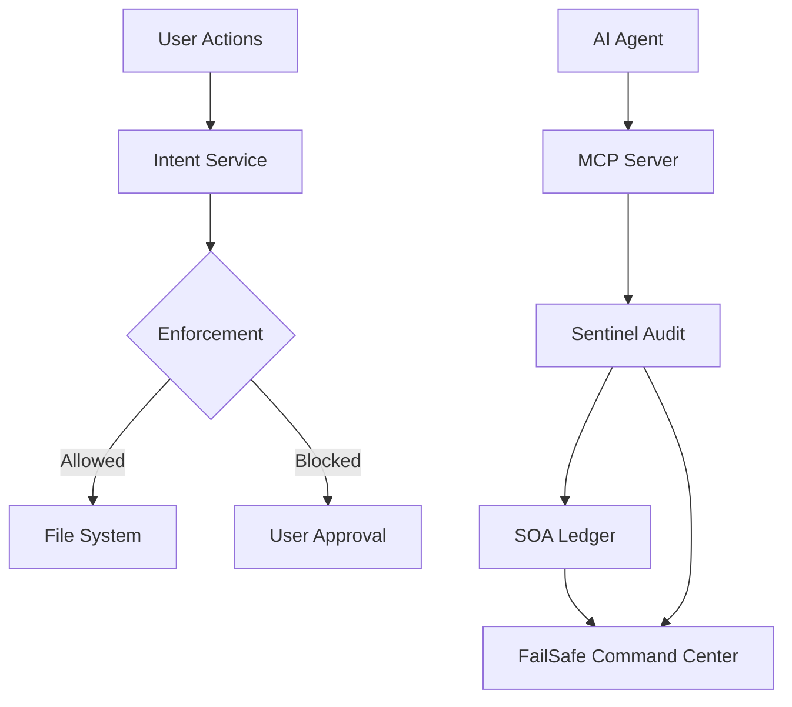

<div align="center">

# FailSafe

**Agent Debugger & Stability Monitor for AI-Assisted Development**

_Local-first safety for AI coding assistants._

**Marketplace Categories**: Machine Learning, Testing, Visualization

[](https://github.com/MythologIQ/FailSafe/stargazers)
[](LICENSE)
[](https://github.com/MythologIQ/FailSafe)
[](https://nodejs.org)
[](https://www.typescriptlang.org)
[](https://marketplace.visualstudio.com/items?itemName=MythologIQ.mythologiq-failsafe)
[](https://open-vsx.org/extension/MythologIQ/mythologiq-failsafe)
[](https://github.com/MythologIQ/FailSafe/releases)
[](docs/FAILSAFE_SPECIFICATION.md)

</div>

---

## 🚀 Introducing FailSafe Pro — Now Available

**FailSafe Pro is the desktop-native, higher-tier application for full-stack AI governance.** Where this open extension guards your editor, **FailSafe Pro guards your entire SDLC** — OS-level enforcement, file locking, team workflows, remote orchestration, and managed runtime operations that go beyond the editor boundary.

[**→ Learn more about FailSafe Pro**](https://mythologiq.studio/products/failsafe-pro) · [**Download FailSafe Pro**](https://mythologiq.studio/products/failsafe-download)

---

<div align="center">

**Current Release**: v5.1.8 (2026-05-22)

> **If this project helps you, please star it!** It helps others discover FailSafe.

## What's new in v5.2.0

The v5.2.0 release delivers on the learning promise: a Learn tab that teaches the software-development craft to non-traditional builders, with a redesigned visual surface and accessibility baseline.

- **Learn tab is now a two-sub-tab `TabGroup`**: `[Read][Glossary]`. Read is default active.
- **Read sub-view**: sectioned essays with per-essay accent rail, inline-SVG icon, read-time chip, pull-quote callout, H4 sub-sections. Sticky horizontal jump-strip (FX619) for at-a-glance navigation + relevant-now dots. Acceptance-criteria template gains a **Copy** button.
- **Glossary sub-view** (renamed from Reference): search input + tag-filter buttons + A-Z/Z-A sort. ~60 unified terms (48 SWE-craft + 12 FailSafe + 1 Bicameral integration partner).
- **Global a11y baseline** in `command-center.css`: `prefers-reduced-motion` honored, global `:focus-visible` on interactive surfaces, `.visually-hidden` SR-label utility, prose `max-width: min(68ch, 100%)`. Closes WCAG 2.3.3 + 2.4.7 + 1.4.4.
- **Fixed: Mindmap "Ollama (Server)" false-positive "Connected"** — the panel previously hardcoded a Connected status with no probe. Now actually probes `http://localhost:11434/api/tags` with 30s TTL and reflects reality (`Connected ✓` / `Not Running` / `Checking…` / `Unavailable`).

See [CHANGELOG.md](CHANGELOG.md) for the full v5.2.0 release notes and `docs/EDUCATION.md` / `docs/LEARN_TAB.md` for component documentation.

## What's new in v5.1.8

- **Bicameral Advanced-tools surface** (B-INT-1): the 11 remaining Bicameral MCP tools (`ingest`, `search`, `brief`, `judgeGaps`, `resolveCompliance`, `linkCommit`, `update`, `reset`, `dashboard`, `validateSymbols`, `getNeighbors`) are now reachable — `POST /api/actions/bicameral-<tool>` routes plus a styled, collapsible **"Advanced tools"** card section with query/mutation tool grouping, per-row loading state, and labelled success/error results.
- **Sentinel-evaluator vs Governance-mode UI disambiguation** (B-EM-1): five UI sites that rendered the Sentinel evaluator mode are relabelled to avoid confusion with the governance mode; the invalid `'observe'` fallback is corrected.
- **Brainstorm node-label truncation feedback** (B132): a dismissible inline notice when a node label is shortened to the 200-character cap — no more silent truncation.
- **B199 test-coverage epic closed**: the CRITICAL Playwright + integration-coverage epic is verified complete and closed.
- **Activation-test regression fix**: a latent v5.1.7 async-timing test regression is fixed; the full `vscode-test` suite is restored to green.

See [CHANGELOG.md](CHANGELOG.md) for the full v5.1.8 release notes.

## What's new in v5.1.7

- **Universal governance interceptor** (B151): an `IGovernanceInterceptor` single-`evaluate` seam — `EngineBackedInterceptor` maps engine verdicts to receipts, `McpInterceptor` adapts MCP envelopes; `BicameralRoute` is migrated through it with behavioural-parity proof. Opens the B190 → B151 → B152 → B153 architecture chain.
- **Bicameral preflight → L3** (B-INT-2): drifted-decision evidence attaches to queued tier-3 L3 approvals; a preflight-conflict line surfaces on the approval card before you approve.
- **Subscribe-without-mutate UI remediation** (B198): a shared accessible modal helper, event-driven Skills-cache invalidation, and TabGroup sub-view lifecycle cleanup.
- **Bicameral hardening**: install-detector symlink-containment + extra-roots allowlist (B-BIC-6/7); decision-row UX — open-binding, capability hint, composite sync, overflow clamp (B-BIC-12/13/14/15); drift verdict events feed Sentinel + the Risks Register (B-BIC-17/18).
- **Test-coverage hardening** (B-B199-3/4/5/6): per-file-scoped E2E coverage-gate overrides, cross-host install-record coverage, and documented voice/stub trade-offs.

See [CHANGELOG.md](CHANGELOG.md) for the full v5.1.7 release notes.

## What's new in v5.1.6

- **Bicameral MCP — HIGH cluster**: 11 typed wrappers for the deferred bicameral tools (ingest, search, brief, judgeGaps, resolveCompliance, linkCommit, update, reset, dashboard, validateSymbols, getNeighbors) + `callRaw` public surface + per-tool runtime guards (B-BIC-19).
- **Live-subprocess integration test**: vendored TypeScript echo-mcp-server spawned via `process.execPath` exercises the real `@modelcontextprotocol/sdk` transport handshake (B-BIC-20).
- **DriftToL3Mediator**: bicameral drift status-edges enqueue L3 approvals; L3 decisions ratify upstream (APPROVED → `ratify`, REJECTED → `reject`, DEFERRED/EXPIRED no-op) (B-BIC-16).
- **Upstream awareness**: pip floor pin `bicameral-mcp>=0.14,<0.16` + `UpstreamMonitor` service (24h poll, SSRF-allowlisted owner/repo slug, fail-closed before any fetch) + `GET /api/integrations/bicameral/upstream` local-only route + Settings card upstream row (B-INT-3).
- **B-B199-2 Replay + Genome behavioral E2E**: 14 new Playwright cases cover the Agents-tab Replay and Genome sub-views (empty state, list/detail nav, WS-event refresh, slice caps).
- **B-EM-2/B-EM-3 enforcement-mode polish**: `ModeTransitionHistory.hydrateFromLedger` replays governance.modeChanged on activation; `FirstRunModePicker` quickpick on initial install.

See [CHANGELOG.md](CHANGELOG.md) for the full v5.1.6 release notes.

## What's new in v5.1.5

- **Bicameral MCP — Integrations tab**: full v1 surface (install bridge, settings card, history/preflight/drift/ratify) plus 5 quick-win hardening fixes (B-BIC-1..5): ratify → META_LEDGER USER_OVERRIDE; extension-deactivate disposer; transport.onclose crash recovery; capability cache; install stdout/stderr ANSI sanitizer.
- **B199 Command Center E2E coverage**: structural Playwright specs for all 6 top-level tabs (Settings, Overview, Skills, Agents, Workspace, Governance) + 16-broadcast WebSocket matrix + real-disk META_LEDGER → /api/hub → Monitor renderer end-to-end (FX511-FX525).
- **B197 qor-logic version-floor surfacing**: hub payload carries `installedVersion` + `meetsFloor`; Settings card surfaces a floor warning when below `MIN_QOR_LOGIC_VERSION`.
- **B194 enforcement-mode escalation UX**: observe-mode advisory banner + Governance tab "Mode Transitions" feed with reverse-chronological history.
- **B193 SentinelDaemon governance-file coverage**: governance markdown/yaml/json watched; canonical fs paths; `.failsafe/governance/` blanket-prefix match.
- **B192 stale-cache remediation**: `WorkspaceMutationBus` substrate routes filesystem mutations to PlanManager + HubSnapshotService + TrustEngine + ConsoleLifecycleService subscribers.
- **B195 voice substrate extraction**: heavy vendor binaries moved out of base VSIX into separate voice-pack companion download.

See [CHANGELOG.md](CHANGELOG.md) for the full v5.1.5 release notes.

## What's new in v5.1.0

- **Model-sourced Risk Register**: coding agents author risks via the MCP tool `failsafe.create_risk`, the `@failsafe /risk` chat subcommand, or FailSafe auto-derives them from SHIELD lifecycle (GATE VETOs, DEBUG entries, Shadow-Genome failure events). The manual "Add Risk" wizard is removed.
- **Install Skills UX expansion**: live-progress modal, per-host skill picker, dry-run preview, operator-editable host registry, and a workspace `LiveProgressInvariant` doctrine.
- **SRE panel**: now attributes the [Microsoft Agent Governance Toolkit](https://github.com/microsoft/agent-governance-toolkit) (data source) and [Qortara](https://www.qortara.com).
- **Release pipeline safety gate**: both VS Code Marketplace and OpenVSX publish jobs now sit behind a `production` GitHub environment requiring reviewer approval.
- **OpenVSX alignment**: VS Code Marketplace and OpenVSX are both at v5.0.0 baseline; v5.1.0 publishes to both.

See [CHANGELOG.md](CHANGELOG.md) for the full v5.1.0 release notes.

## FailSafe and FailSafe Pro

FailSafe is the open-source VS Code and Cursor extension for local AI coding governance — audits, skills, checkpoints, and editor-visible safety workflows. Skills are sourced from the [`qor-logic`](https://pypi.org/project/qor-logic/) PyPI package.

FailSafe Pro is the desktop native application for SDLC visibility and governance — OS-level enforcement, file locking, team workflows, and remote connections beyond the editor boundary.

Use FailSafe when you want local editor guardrails. Use FailSafe Pro when you need full SDLC visibility and managed runtime operations.

Learn more: <https://mythologiq.studio/products/failsafe-pro>
Download: <https://mythologiq.studio/products/failsafe-download>


[Quick Start](#quick-example) | [Documentation](docs/FAILSAFE_SPECIFICATION.md) | [VS Code Extension](https://marketplace.visualstudio.com/items?itemName=MythologIQ.mythologiq-failsafe) | [Open VSX](https://open-vsx.org/extension/MythologIQ/mythologiq-failsafe) | [Roadmap](docs/ROADMAP.md)

<br/>

_FailSafe is open source. Fork it, open issues, and submit pull requests._

> FailSafe transitioned from beta to stable release on 2026-02-28. We expect even greater things to come Thank you for being part of our journey. See [Terms and Conditions](#terms-and-conditions).

</div>

---

<p align="center">
  
</p>

## UI Preview


---

## What You Will Configure in 5 Minutes

Create or edit `.failsafe/config/policies/risk_grading.json` to tune risk classification:

```json
{
  "filePathTriggers": {
    "L3": ["auth", "payment", "credential"]
  },
  "contentTriggers": {
    "L3": ["DROP TABLE", "api_key"]
  }
}
```

**Result:** Risk grading overrides are loaded on startup when this JSON file is present. Defaults apply when it is missing. Top-level sections replace defaults, so include full sections if you want to preserve them.

---

## What Is FailSafe?

FailSafe is an open-source VS Code extension and stability monitoring framework for AI-assisted development. It adds intent-gated saves, Sentinel audits, and a ledgered audit trail so risky changes are surfaced and controlled.

FailSafe separates system awareness from system control.

The Monitor provides real-time visibility into system health, governance posture, and operational risk. It is designed for continuous, low-effort awareness.

The Command Center is the primary control surface where teams plan, execute, and govern AI workflows. All configuration, orchestration, and audits originate here.

This separation reduces cognitive load and mirrors real-world operations environments: observe first, act deliberately.

Primary UI surfaces in the current release:

- `FailSafe Monitor` (compact)
- `FailSafe Command Center` (extended)

## UI Screenshots

### Monitor


### Home


### Skills


### Governance


---

## The Idea

**Prompt-based safety** asks the LLM to follow rules. The LLM decides whether to comply.

**Kernel-style safety** evaluates actions at the editor boundary using policies, heuristics, and optional LLM analysis.

---

## Architecture



---

## Directory Structure

FailSafe uses a **Physical Isolation** model to separate workspace governance from application development.

### Workspace Root (Governance)

```
/ (root)
+-- .agent/                   # Active workspace workflows
+-- .claude/                  # Active commands + secure tokens
+-- .qorelogic/               # Workspace configuration (locked)
+-- docs/                     # Workspace governance (Ledger, State, Spec)
+-- FAILSAFE_SPECIFICATION.md -> docs/FAILSAFE_SPECIFICATION.md
```

### App Container (Extension Source)

```
/FailSafe/ (container)
+-- extension/                # VS Code Extension TypeScript Project
+-- build/                    # Build & validation tooling
```

**Note:** A single extension publishes to both VS Code Marketplace and Open VSX via GitHub Actions. Claude Code skills are located at `.claude/skills/qor-*/SKILL.md`.

---

## Core Systems

| System    | Layer       | Description                                |
| --------- | ----------- | ------------------------------------------ |
| Genesis   | Experience  | FailSafe Monitor + FailSafe Command Center |
| Qor-Logic | Governance  | Intent gating, policies, ledger, and trust |
| Sentinel  | Enforcement | File watcher audits and verdicts           |

### Governance Modes

FailSafe supports three governance modes to match your workflow needs:

| Mode        | Behavior                                                           | Best For                         |
| ----------- | ------------------------------------------------------------------ | -------------------------------- |
| **Observe** | No blocking, just visibility and logging. Zero friction.           | New users, exploration, learning |
| **Assist**  | Smart defaults, auto-intent creation, gentle prompts. Recommended. | Most development workflows       |
| **Enforce** | Full control, intent-gated saves, L3 approvals.                    | Compliance, regulated industries |

Switch modes via the `FailSafe: Set Governance Mode` command or the `failsafe.governance.mode` setting.

---

## Qor-Logic: The Governance Layer

Qor-Logic is the deterministic governance engine that enforces safety policies at the editor boundary. It operates on a fundamental principle: **governance decisions are made by code, not by asking an LLM to follow rules.**

### Prompt Guidelines vs. Deterministic Governance

| Aspect             | Prompt-Based Safety                     | Qor-Logic Deterministic Governance   |
| ------------------ | --------------------------------------- | ------------------------------------ |
| **Decision Maker** | LLM interprets rules                    | TypeScript code executes rules       |
| **Consistency**    | Varies with context, temperature, model | Identical output for identical input |
| **Auditability**   | Opaque reasoning chain                  | Explicit code path, logged decisions |
| **Bypass Risk**    | LLM can ignore or reinterpret           | Code cannot be persuaded             |
| **Speed**          | Network latency + inference             | Sub-millisecond local execution      |

### How Qor-Logic Works

1. **Risk Classification** — Files are classified as L1 (low), L2 (medium), or L3 (high) risk based on:
   - File path triggers (e.g., `auth/`, `payment/`, `credential` → L3)
   - Content triggers (e.g., `DROP TABLE`, `api_key`, `private_key` → L3)
   - Configurable via `.failsafe/config/policies/risk_grading.json`

2. **Policy Evaluation** — Each risk grade has deterministic requirements:
   - **L1**: Heuristic check, 10% sampling, auto-approve
   - **L2**: Full Sentinel pass, no auto-approve
   - **L3**: Formal verification + human approval required

3. **Ledger Recording** — Every governance decision is recorded to an append-only SOA ledger with:
   - Agent identity and trust score
   - Artifact path and risk grade
   - Timestamp and decision rationale

4. **Trust Dynamics** — Agent trust scores evolve based on outcomes:
   - Approved L3 actions → trust increase
   - Rejected or failed actions → trust decrease
   - Trust scores influence future routing decisions

### Why Deterministic Matters

When an LLM is asked to enforce safety rules, it can:

- Reinterpret rules based on context
- Produce inconsistent decisions across similar inputs
- Be influenced by prompt engineering attacks

Qor-Logic avoids these risks by executing deterministic TypeScript code at the governance boundary. The policy engine uses simple string matching and path analysis—no LLM inference required for governance decisions.

**Example**: A file containing `api_key` will always trigger L3 classification. No prompt can persuade the code to ignore this trigger.

---

## IDE Extension

| Extension | Description                                  |
| --------- | -------------------------------------------- |
| VS Code   | Save-time governance, audits, and dashboards |

---

## Install

FailSafe provides governance for multiple AI development environments:

### VS Code Extension (Save-Time Governance)

Install the FailSafe extension for real-time governance, audits, and dashboards.

**VS Code Marketplace:**

```
ext install MythologIQ.mythologiq-failsafe
```

Or: https://marketplace.visualstudio.com/items?itemName=MythologIQ.mythologiq-failsafe

**Open VSX (VSCodium, Gitpod, etc.):**

```
ext install MythologIQ.mythologiq-failsafe
```

Or: https://open-vsx.org/extension/MythologIQ/mythologiq-failsafe

---

### Antigravity Extension (Gemini + Claude Code)

Install from **Open VSX** (VSCodium, Gitpod, Cursor, etc.):

```
ext install MythologIQ.mythologiq-failsafe
```

Or: https://open-vsx.org/extension/MythologIQ/mythologiq-failsafe

The Antigravity extension includes:

- **Gemini/Antigravity workflows** (`.agent/workflows/`)
- **Claude Code skills** (`.claude/skills/qor-*/SKILL.md`)
- **Qor-Logic personas** (Governor, Judge, Specialist)
- **Stability monitoring configuration** and skills

---

### VSCode Copilot Extension (Copilot + Claude Code)

Install from **VS Code Marketplace**:

```
ext install MythologIQ.mythologiq-failsafe
```

Or: https://marketplace.visualstudio.com/items?itemName=MythologIQ.mythologiq-failsafe

The VSCode extension includes:

- **Copilot prompt files** (`.github/prompts/`)
- **Claude Code skills** (`.claude/skills/qor-*/SKILL.md`)
- **Agent personas** (`.github/copilot-instructions/`)
- **Stability monitoring configuration** and skills

### The SHIELD Workflow (Claude Code)

Both extensions include Claude Code slash commands that map to the physical **SHIELD** governance lifecycle:

- **S - SECURE INTENT** (`/qor-bootstrap`): Seed project DNA. Document the Why, encode the architecture, initialize the Merkle chain.
- **H - HYPOTHESIZE** (`/qor-plan`): Create implementation blueprints with risk grades, file contracts, and Section 4 complexity limits.
- **I - INTERROGATE** (`/qor-audit`): Adversarial tribunal. The Judge audits the plan for security, correctness, and drift. PASS or VETO.
- **E - EXECUTE** (`/qor-implement`): Build under KISS constraints after a PASS verdict. Functions under 40 lines. Nesting under 3 levels.
- **L - LOCK PROOF** (`/qor-substantiate`): Verify Reality matches Promise. Cryptographically seal the session with Merkle hash verification.
- **D - DELIVER** (`/qor-release`): Deploy, inspect packaged artifacts before publish, hand off with traceability, and monitor for operational drift.

---

## Quick Example

```bash
# Run FailSafe locally
cd FailSafe/extension
npm install
npm run compile
```

---

## What's New in v4.9.0

> _Agent debugging, execution replay, and cross-agent skill portability._

### Highlights

- **Agent Run Replay and Execution Timeline** - Step-by-step replay of AI agent execution traces with a filterable event timeline and severity indicators for rapid root-cause analysis.
- **Risk and Stability Indicators** - Composite health score displayed in the status bar, combining risk grade distribution, Sentinel verdicts, and trust dynamics into a single signal.
- **Shadow Genome and DiffGuard Panels** - Failure pattern analysis (Shadow Genome) and AI diff risk analysis (DiffGuard) surfaced as dedicated debugging panels in the Command Center.
- **Cross-Agent Skill Propagation** - Skills defined once propagate across Claude Code, Codex CLI, GitHub Copilot, Gemini, Cursor, and Windsurf via standardized adapters.

> **We'd love your review!** If FailSafe is useful to you, please leave a review on the [VS Code Marketplace](https://marketplace.visualstudio.com/items?itemName=MythologIQ.mythologiq-failsafe) or [Open VSX](https://open-vsx.org/extension/MythologIQ/mythologiq-failsafe). Your feedback helps other developers discover FailSafe and directly shapes its roadmap. Bug reports and feature requests welcome on [GitHub Issues](https://github.com/MythologIQ/FailSafe/issues).

---

## Upcoming Features (On the Roadmap)

- **CI/CD Pipeline Enforcer**: Headless Judge verification validating `failsafe_checkpoints` via cryptography during PRs.
- **Shared "Core Axioms"**: IDE startup synchronization of enterprise-level Policy and Axioms to enforce team-wide Q-DNA compliance.
- **Air-Gapped Judge Verification**: Support for routing L3 architectural audits to local LLMs (Ollama, LM Studio, etc.) for zero-leak compliance.
- **CLI Overseer Lite**: Lightweight CLI-compatible FailSafe for direct website integration.

---

## Status

FailSafe is a stable release. While we strive for reliability and completeness, all software carries inherent risks.

---

## Terms and Conditions

FailSafe is provided "as is" without warranties of any kind, express or implied. While we have made every effort to ensure the software's reliability and security, you acknowledge that you use this software at your own risk.

**By using FailSafe, you agree to the following:**

1. **Use at Your Own Risk**: FailSafe is designed to assist with debugging and stability monitoring for AI-assisted development, but it cannot guarantee complete protection against all risks. You remain responsible for reviewing and validating all AI-generated code and decisions.

2. **No Warranty**: MythologIQ provides no warranties, express or implied, including but not limited to warranties of merchantability, fitness for a particular purpose, or non-infringement.

3. **Limitation of Liability**: MythologIQ shall not be liable for any direct, indirect, incidental, special, consequential, or punitive damages arising from use of FailSafe, including but not limited to loss of data, downtime, business interruption, or any other damages.

4. **Data Backups**: You are responsible for maintaining appropriate backups of your work. FailSafe includes governance and checkpoint features, but these do not replace proper backup practices.

5. **Compliance**: You are responsible for ensuring your use of FailSafe complies with applicable laws, regulations, and organizational policies.

6. **Updates and Changes**: FailSafe may receive updates that include new features, bug fixes, or changes to existing functionality. You are responsible for reviewing release notes and understanding how updates may affect your workflow.

7. **Feedback and Contributions**: We welcome feedback, bug reports, and contributions. By contributing, you agree to license your contributions under the project's Apache License 2.0.

**Thank you for being part of our journey.** Your trust and feedback help us improve FailSafe for everyone.

---

## Contributing

```bash
git clone https://github.com/MythologIQ/FailSafe.git
cd FailSafe
npm install
```

---

## License

Apache License 2.0 - See [LICENSE](LICENSE)

---

<div align="center">

**Open source stability monitoring for AI coding agents.**

[GitHub](https://github.com/MythologIQ/FailSafe) | [Docs](docs/FAILSAFE_SPECIFICATION.md)

</div>

<!-- CHECKPOINT-DEEP-DIVE:START -->

## UI Snapshot


## Checkpoint Integrity and Local Memory

FailSafe tracks more than Git state. It records governance checkpoints as signed metadata records, then stores Sentinel observations in a local retrieval store so operators can recover the _what_, _why_, and _how_ of runtime decisions.

### Process Reality

1. Git readiness is enforced at bootstrap (`ensureGitRepositoryReady`), including optional auto-install and `git init` when needed.
2. Governance events are checkpointed into `failsafe_checkpoints` with run/phase/status context and deterministic hashes.
3. Each checkpoint carries `git_hash`, `payload_hash`, `entry_hash`, and `prev_hash` so chain integrity can be recomputed.
4. Hub and API surfaces expose both summary and recent checkpoint records for operational visibility.
5. Sentinel writes local memory records to `.failsafe/rag/sentinel-rag.db` (or JSONL fallback), including `payload_json`, `metadata_json`, and retrieval text.

### Technical Advantages

- Tamper evidence via hash-chained checkpoint records.
- Git-linked governance state for repository-correlated audit trails.
- Local-first memory retention for security and low-latency recall.
- Deterministic fallback paths when SQLite is unavailable.

### Claim-to-Source Map

| Claim                                                                                       | Status      | Source                                                                                                                                                           |
| ------------------------------------------------------------------------------------------- | ----------- | ---------------------------------------------------------------------------------------------------------------------------------------------------------------- |
| Checkpoints persist in `failsafe_checkpoints` with typed governance fields.                 | implemented | `FailSafe/extension/src/roadmap/RoadmapServer.ts`                                                                                                      |
| Checkpoint records include hash-chain material (`payload_hash`, `entry_hash`, `prev_hash`). | implemented | `FailSafe/extension/src/roadmap/RoadmapServer.ts`                                                                                                      |
| Each checkpoint captures current Git head/hash context.                                     | implemented | `FailSafe/extension/src/roadmap/RoadmapServer.ts`                                                                                                      |
| Checkpoint history and chain validity are exposed over API.                                 | implemented | `FailSafe/extension/src/roadmap/RoadmapServer.ts`                                                                                                      |
| Hub snapshot includes `checkpointSummary` and `recentCheckpoints`.                          | implemented | `FailSafe/extension/src/roadmap/RoadmapServer.ts`                                                                                                      |
| Sentinel local RAG persists observation payload + metadata + retrieval text.                | implemented | `FailSafe/extension/src/sentinel/SentinelRagStore.ts`                                                                                                      |
| Sentinel RAG can fall back to JSONL when SQLite is unavailable.                             | implemented | `FailSafe/extension/src/sentinel/SentinelRagStore.ts`                                                                                                      |
| RAG writes are controlled by `failsafe.sentinel.ragEnabled` (default `true`).               | implemented | `FailSafe/extension/src/sentinel/SentinelDaemon.ts`                                                                                                      |
| Checkpoint and Sentinel RAG tables are independent (no foreign-key link).                   | **false**   | Confirmed: `failsafe_checkpoints` (ledger DB) and `sentinel_observations` (RAG DB) are in separate databases with no shared keys. `evidenceRefs` is always `[]`. |

<!-- CHECKPOINT-DEEP-DIVE:END -->
