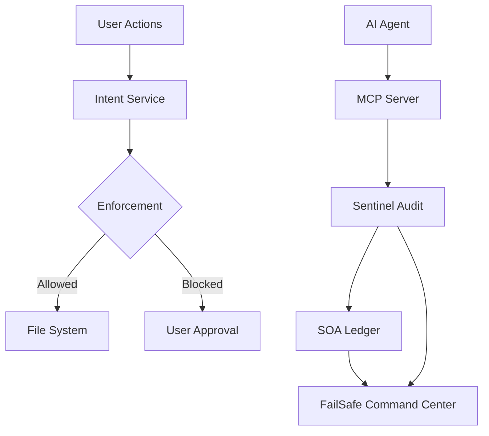

<div align="center">

# FailSafe

**Agent Debugger & Stability Monitor for AI-Assisted Development**

_Local-first safety for AI coding assistants._

**Marketplace Categories**: Machine Learning, Testing, Visualization

[](https://github.com/MythologIQ/FailSafe/stargazers)
[](LICENSE)
[](https://github.com/MythologIQ/FailSafe)
[](https://nodejs.org)
[](https://www.typescriptlang.org)
[](https://marketplace.visualstudio.com/items?itemName=MythologIQ.mythologiq-failsafe)
[](https://open-vsx.org/extension/MythologIQ/mythologiq-failsafe)
[](https://github.com/MythologIQ/FailSafe/releases)
[](docs/FAILSAFE_SPECIFICATION.md)

</div>

---

## 🔌 Integrations — govern your entire AI toolchain, not just the editor

FailSafe turns the editor into a **governance hub** for the tools your AI agents actually use. Every integration is **local-first, opt-in, and routed through the same deterministic policy engine** that guards your edits — so connecting a tool never widens your attack surface or sends data anywhere by default. Each integration ships with its own README (`src/integrations/<name>/README.md`) and the external API names it depends on are back-cited to official docs in [`docs/integrations/INTEGRATION_DOCS_INDEX.md`](docs/integrations/INTEGRATION_DOCS_INDEX.md).

**Govern the agents themselves** — run a headless coding agent through FailSafe and gate what it does:

| Integration | What it does | Why it matters |
|---|---|---|
| 🤖 **Continue (`cn`) governed wrapper** | Run a Continue headless prompt through FailSafe with a tool allowlist; the produced diff is risk-classified and L3-risk changes route to human approval (`FailSafe: Run Continue (governed)`). | The agent runs argv-form (no shell), the API key never leaves the child env, and a shell/write allowlist is escalated **before** it can act. |
| 🔧 **Aider git-gate wrapper** | Run Aider with auto-commit off, capture the uncommitted diff, and route high-risk changes to L3 (`FailSafe: Run Aider (governed)`). | A dirty worktree is refused so the captured diff is unambiguously the agent's — your commit gate, not the agent's. |
| 👁️ **OpenHands run observer** | Map an exported OpenHands run into FailSafe transparency records, version-gated and read-only (`FailSafe: Import OpenHands Run (observe)`). | See what a full agent-loop runtime actually did, scored by risk — without ever mutating a live run. |
| 🔎 **Cline / Roo / Kilo policy audit** | Scan workspace MCP/tool config and flag risky posture — remote MCP servers, wildcard auto-approval, shell-capable tools (`FailSafe: Audit Agent MCP Policy`). | Catch an over-permissioned agent before it bites; secrets in the config are redacted before any finding is recorded. |

**Connect your issue tracker, security, and team tooling** — govern the whole toolchain:

| Integration | What it does | Why it matters |
|---|---|---|
| 📥 **Linear / Jira issue import** | Resolve a Linear or Jira issue URL/key to an **uncommitted intent preview** — read-only (`FailSafe: Import Linear/Jira Issue (preview)`). | Your tracker is the intent source; FailSafe pulls the ticket context so you never retype it — and nothing is created or synced without you. |
| ✅ **GitHub PR checks** | Publish FailSafe SHIELD verdicts (PASS/WARN/VETO) as GitHub Check Runs at the merge gate (`FailSafe: Publish SHIELD Verdict to GitHub Check`). | Your governance verdict shows up **where the merge happens**, not just in the local console; fork PRs degrade to local-only. |
| 🐞 **Sentry regression correlation** | Pull a Sentry project's unresolved issues into the risk register as runtime-regression risks (`FailSafe: Import Sentry Regressions`). | Production failures become governed risk records tied to project / environment / release — no raw event payloads stored. |
| 🛡️ **SARIF security ingestion** | Import Semgrep / CodeQL / any SARIF 2.1.0 scanner output into the risk register (`FailSafe: Import SARIF Findings`). | Your security scanner stops being a separate silo — every finding becomes a *governed* risk in the same audit trail as agent decisions. |
| 📣 **Slack / Microsoft Teams notifications** | Post VETO / L3-approval / drift events to a Slack or Teams webhook. Notify-only, off by default. | Governance becomes a **team** signal: when FailSafe blocks a risky action or queues a human approval, the right people see it in their channel. |
| 🧮 **MCP Registry risk scoring** | Score any MCP server locally — read-only, with field sanitization — before you trust it. | The MCP ecosystem is exploding and anything can claim to be a tool server. Adopt servers on **evidence, not vibes**. |
| 📦 **MCP Catalog installers** | One-click, risk-scored installs of **Context7**, **Mermaid Chart**, and **Playwright MCP** into your `.mcp.json` (`FailSafe: Install MCP Integration (governed)`). | Governed installs of tools that make your agents measurably better, with the trust check built in. |
| 🧠 **Bicameral MCP** | Detect, connect, and ratify architecture *decision* records and their drift inline. | Every Bicameral tool call passes through FailSafe's universal interceptor — the reasoning behind your system stays as governed as the code. |
| 🎨 **Open Design** | Observe Open Design agent runs and act on them via the L3-gated `create_artifact`. | Design tooling gets the same human-in-the-loop guarantee as everything else FailSafe touches. |
| 🧰 **Agent Governance Toolkit installer** | Auto-detect your workspace environment and serve the matching, registry-verified AGT installer. | One governed entry point to instrument whatever stack you actually run. |

Under the hood, a **Tier 1 supply-chain CI baseline** (least-privilege workflow tokens, SHA-pinned Actions, dependency review, CODEOWNERS) hardens the repository itself against Shai-Hulud-class attacks.

**Everything above is disabled by default and runs locally — no network call until you turn one on.** Open the **Integrations** tab to connect.

---

<div align="center">

**Current Release**: v6.0.5 (2026-09-04)

> **If this project helps you, please star it!** It helps others discover FailSafe.

## What's new in v6.0.5

- **A voice glitch that blocked unrelated updates is gone.** A timing check in the speech engine measured itself against a stopwatch that could round the wrong way, so it failed at random and held up routine dependency updates. It now measures deterministically.
- **Generated test screenshots stop landing in the repository.** An ignore rule pointed at a folder path that does not exist, so it never took effect and a few build artifacts were committed by accident.
- **The system-state document tells the truth again.** It had been reporting v5.9.0 as the current release while v6.0.4 was shipping, and nothing checked it. It does now.
- **The governance index distinguishes "deliberately private" from "missing".** Several documents it lists are intentionally unpublished; readers previously had no way to tell those apart from a broken entry — and one entry was genuinely broken, pointing at a file that has never existed in the repository.
- **A duplicate feature ID has been resolved,** and a check added so the next one is caught rather than discovered.

Under the hood this release is governance plumbing: five checks were found reporting success while inspecting nothing at all, and each now has a test that proves it can fail. Four issues were filed upstream against Qor-logic.

## What's new in v6.0.0

- **The pre-commit guard is real.** The commit-check endpoint ships (it was documented but never implemented), the hook's port tracks the live Console server, and installing from a git worktree governs every worktree of the repo.
- **Guided Agents-window setup.** `FailSafe: Configure VS Code Agents Window Governance` walks the opt-in, worktree commit-hook install, and governed MCP integration installs.
- **Repository-scoped first-run.** Each repository gets its own governance-mode decision; an explicitly configured mode anywhere suppresses re-prompting.
- **Accessible Mind Map.** The graph carries an accessible name and a LIST VIEW toggle renders real node/edge tables — same pattern as the Shadow Genome table view.
- **Integration hardening + a 69% smaller package.** MCP installs can no longer destroy an unparseable `.mcp.json`; SARIF/Sentry imports are malformed-proof and never silently drop findings; the PR-linkage check paginates (no more false findings); build intermediates and governance scan outputs can never ship in the VSIX.
- **Enforce is now the default governance mode.** New and never-configured installs gate writes out of the box (intent-gated saves, L3 approvals). Observe and Assist are unchanged and one command away (`FailSafe: Set Governance Mode`); a one-time notice on upgrade offers the mode picker. Unresolvable mode values and a missing ACP mode mirror now fail closed to enforce.
- **Enforcement works on every tier.** The editor enforcement path no longer consults any feature gate.
- **Enforce-mode Create Intent flow.** Creating an intent in enforce mode first selects the plan it serves, with an explicit switch-mode escape; the writes-blocked dialog offers `Set Governance Mode`.
- **Cleaner product surface.** The observe-mode advisory banner and settings hint are removed, and `/api/v1/status` now reports the true governance mode.
- **Agent Skills marketplace category.** Install the MIT-licensed [mattpocock/skills](https://github.com/mattpocock/skills) packs (Wayfinder decision-ticket planning + engineering/productivity companions) as governed, risk-scored marketplace entries.
- **Mind Map view prefs survive reload on any machine.** Fixed a view-preferences identity race caught by the release gate.
- **More fail-closed hardening + accessibility.** GovernanceRouter verdict faults now block instead of silently allowing; malformed verdict payloads escalate instead of silently PASSing; a malformed META_LEDGER reads as damaged, not idle; L3 escalation-queue failures fail visibly; ACP mirror-write and fs no-client paths fail closed; real ARIA tab semantics on the Command Center nav and sub-view pills; Space push-to-talk guarded against focused controls.

## What's new in v5.9.0

- 📌 **The Development Tracker stays put** — no reload on live refresh, fills the available space, and exports to a clean PDF.
- 🌱 **The Mind Map starts from your repo** — preloads a knowledge graph from your governance history, kept distinct from your brainstorm work.
- 🗂️ **Workspace › Taxonomy editor** — edit the tracker's programs / verticals / agent mappings; Save writes a governed config the assistant consults next cycle.
- 🧬 **Shadow Genome tells the truth** — "Graph Nodes" (not "Failure Nodes"), Observed can't contradict the failure count, dense graphs open as a readable table. See [CHANGELOG.md](CHANGELOG.md).

## Previous releases

The full release-by-release history (v5.x and earlier) lives in [CHANGELOG.md](CHANGELOG.md).

## About FailSafe

FailSafe is the open-source VS Code and Cursor extension for local AI coding governance — audits, skills, checkpoints, and editor-visible safety workflows. Skills are sourced from the [`qor-logic`](https://pypi.org/project/qor-logic/) PyPI package.


[Quick Start](#quick-example) | [Documentation](docs/FAILSAFE_SPECIFICATION.md) | [VS Code Extension](https://marketplace.visualstudio.com/items?itemName=MythologIQ.mythologiq-failsafe) | [Open VSX](https://open-vsx.org/extension/MythologIQ/mythologiq-failsafe) | [Roadmap](docs/ROADMAP.md)

<br/>

_FailSafe is open source. Fork it, open issues, and submit pull requests._

> FailSafe transitioned from beta to stable release on 2026-02-28. We expect even greater things to come Thank you for being part of our journey. See [Terms and Conditions](#terms-and-conditions).

</div>

---

<p align="center">
  
</p>

## UI Preview


---

## What You Will Configure in 5 Minutes

Create or edit `.failsafe/config/policies/risk_grading.json` to tune risk classification:

```json
{
  "filePathTriggers": {
    "L3": ["auth", "payment", "credential"]
  },
  "contentTriggers": {
    "L3": ["DROP TABLE", "api_key"]
  }
}
```

**Result:** Risk grading overrides are loaded on startup when this JSON file is present. Defaults apply when it is missing. Top-level sections replace defaults, so include full sections if you want to preserve them.

---

## What Is FailSafe?

FailSafe is an open-source VS Code extension and stability monitoring framework for AI-assisted development. It adds intent-gated saves, Sentinel audits, and a ledgered audit trail so risky changes are surfaced and controlled.

FailSafe separates system awareness from system control.

The Monitor provides real-time visibility into system health, governance posture, and operational risk. It is designed for continuous, low-effort awareness.

The Command Center is the primary control surface where teams plan, execute, and govern AI workflows. All configuration, orchestration, and audits originate here.

This separation reduces cognitive load and mirrors real-world operations environments: observe first, act deliberately.

Primary UI surfaces in the current release:

- `FailSafe Monitor` (compact)
- `FailSafe Command Center` (extended)

## UI Screenshots

### Monitor


### Home


### Skills


### Governance


---

## The Idea

**Prompt-based safety** asks the LLM to follow rules. The LLM decides whether to comply.

**Kernel-style safety** evaluates actions at the editor boundary using policies, heuristics, and optional LLM analysis.

---

## Architecture


```mermaid
graph TD
    A[User Actions] --> B[Intent Service]
    B --> C{Enforcement}
    C -- Allowed --> D[File System]
    C -- Blocked --> E[User Approval]

    F[AI Agent] --> G[MCP Server]
    G --> H[Sentinel Audit]
    H --> I[SOA Ledger]

    I --> J[FailSafe Command Center]
    H --> J
```

---

## Directory Structure

FailSafe uses a **Physical Isolation** model to separate workspace governance from application development.

### Workspace Root (Governance)

```
/ (root)
+-- .agent/                   # Active workspace workflows
+-- .claude/                  # Active commands + secure tokens
+-- .qorelogic/               # Workspace configuration (locked)
+-- docs/                     # Workspace governance (Ledger, State, Spec)
+-- FAILSAFE_SPECIFICATION.md -> docs/FAILSAFE_SPECIFICATION.md
```

### App Container (Extension Source)

```
/FailSafe/ (container)
+-- extension/                # VS Code Extension TypeScript Project
+-- build/                    # Build & validation tooling
```

**Note:** A single extension publishes to both VS Code Marketplace and Open VSX via GitHub Actions. Claude Code skills are located at `.claude/skills/qor-*/SKILL.md`.

---

## Core Systems

| System    | Layer       | Description                                |
| --------- | ----------- | ------------------------------------------ |
| Genesis   | Experience  | FailSafe Monitor + FailSafe Command Center |
| Qor-Logic | Governance  | Intent gating, policies, ledger, and trust |
| Sentinel  | Enforcement | File watcher audits and verdicts           |

### Governance Modes

FailSafe supports three governance modes to match your workflow needs:

| Mode        | Behavior                                                           | Best For                         |
| ----------- | ------------------------------------------------------------------ | -------------------------------- |
| **Enforce** | Default. Full control, intent-gated saves, L3 approvals.           | Governed development, compliance |
| **Assist**  | Smart defaults, auto-intent creation, gentle prompts.              | Lighter-touch workflows          |
| **Observe** | No blocking, just visibility and logging. Zero friction.           | Exploration, learning            |

Enforce is the default mode. Switch modes via the `FailSafe: Set Governance Mode` command or the `failsafe.governance.mode` setting.

---

## Qor-Logic: The Governance Layer

Qor-Logic is two things working as one: the **deterministic governance engine** that enforces safety policies at the editor boundary, and the **SHIELD skill corpus** — sourced from the [`qor-logic`](https://pypi.org/project/qor-logic/) PyPI package — that drives a governed _plan → audit → implement → substantiate → deliver_ lifecycle for AI-assisted work. Both rest on one principle: **governance decisions are made by code, not by asking an LLM to follow rules.**

### Prompt Guidelines vs. Deterministic Governance

| Aspect             | Prompt-Based Safety                     | Qor-Logic Deterministic Governance   |
| ------------------ | --------------------------------------- | ------------------------------------ |
| **Decision Maker** | LLM interprets rules                    | TypeScript code executes rules       |
| **Consistency**    | Varies with context, temperature, model | Identical output for identical input |
| **Auditability**   | Opaque reasoning chain                  | Explicit code path, logged decisions |
| **Bypass Risk**    | LLM can ignore or reinterpret           | Code cannot be persuaded             |
| **Speed**          | Network latency + inference             | Sub-millisecond local execution      |

### How Qor-Logic Works

1. **Risk Classification** — Files are classified as L1 (low), L2 (medium), or L3 (high) risk based on:
   - File path triggers (e.g., `auth/`, `payment/`, `credential` → L3)
   - Content triggers (e.g., `DROP TABLE`, `api_key`, `private_key` → L3)
   - Configurable via `.failsafe/config/policies/risk_grading.json`

2. **Policy Evaluation** — Each risk grade has deterministic requirements:
   - **L1**: Heuristic check, 10% sampling, auto-approve
   - **L2**: Full Sentinel pass, no auto-approve
   - **L3**: Formal verification + human approval required

3. **Ledger Recording** — Every governance decision is recorded to an append-only SOA ledger with:
   - Agent identity and trust score
   - Artifact path and risk grade
   - Timestamp and decision rationale

4. **Trust Dynamics** — Agent trust scores evolve based on outcomes:
   - Approved L3 actions → trust increase
   - Rejected or failed actions → trust decrease
   - Trust scores influence future routing decisions

5. **Universal Interception** — The same deterministic boundary governs more than file edits. Every MCP tool call from a connected integration (Bicameral, Open Design, MCP Catalog servers) is routed through a single `IGovernanceInterceptor` seam, so a risky _tool invocation_ is classified, gated, and ledgered exactly like a risky _edit_. Governance follows the agent wherever it acts.

### Why Deterministic Matters

When an LLM is asked to enforce safety rules, it can:

- Reinterpret rules based on context
- Produce inconsistent decisions across similar inputs
- Be influenced by prompt engineering attacks

Qor-Logic avoids these risks by executing deterministic TypeScript code at the governance boundary. The policy engine uses simple string matching and path analysis—no LLM inference required for governance decisions.

**Example**: A file containing `api_key` will always trigger L3 classification. No prompt can persuade the code to ignore this trigger.

---

## IDE Extension

| Extension | Description                                  |
| --------- | -------------------------------------------- |
| VS Code   | Save-time governance, audits, and dashboards |

---

## Install

FailSafe provides governance for multiple AI development environments:

### VS Code Extension (Save-Time Governance)

Install the FailSafe extension for real-time governance, audits, and dashboards.

**VS Code Marketplace:**

```
ext install MythologIQ.mythologiq-failsafe
```

Or: https://marketplace.visualstudio.com/items?itemName=MythologIQ.mythologiq-failsafe

**Open VSX (VSCodium, Gitpod, etc.):**

```
ext install MythologIQ.mythologiq-failsafe
```

Or: https://open-vsx.org/extension/MythologIQ/mythologiq-failsafe

---

### Antigravity Extension (Gemini + Claude Code)

Install from **Open VSX** (VSCodium, Gitpod, Cursor, etc.):

```
ext install MythologIQ.mythologiq-failsafe
```

Or: https://open-vsx.org/extension/MythologIQ/mythologiq-failsafe

The Antigravity extension includes:

- **Gemini/Antigravity workflows** (`.agent/workflows/`)
- **Claude Code skills** (`.claude/skills/qor-*/SKILL.md`)
- **Qor-Logic personas** (Governor, Judge, Specialist)
- **Stability monitoring configuration** and skills

---

### VSCode Copilot Extension (Copilot + Claude Code)

Install from **VS Code Marketplace**:

```
ext install MythologIQ.mythologiq-failsafe
```

Or: https://marketplace.visualstudio.com/items?itemName=MythologIQ.mythologiq-failsafe

The VSCode extension includes:

- **Copilot prompt files** (`.github/prompts/`)
- **Claude Code skills** (`.claude/skills/qor-*/SKILL.md`)
- **Agent personas** (`.github/copilot-instructions/`)
- **Stability monitoring configuration** and skills

### The SHIELD Workflow (Claude Code)

Both extensions include Claude Code slash commands that map to the physical **SHIELD** governance lifecycle:

- **S - SECURE INTENT** (`/qor-bootstrap`): Seed project DNA. Document the Why, encode the architecture, initialize the Merkle chain.
- **H - HYPOTHESIZE** (`/qor-plan`): Create implementation blueprints with risk grades, file contracts, and Section 4 complexity limits.
- **I - INTERROGATE** (`/qor-audit`): Adversarial tribunal. The Judge audits the plan for security, correctness, and drift. PASS or VETO.
- **E - EXECUTE** (`/qor-implement`): Build under KISS constraints after a PASS verdict. Functions under 40 lines. Nesting under 3 levels.
- **L - LOCK PROOF** (`/qor-substantiate`): Verify Reality matches Promise. Cryptographically seal the session with Merkle hash verification.
- **D - DELIVER** (`/qor-release`): Deploy, inspect packaged artifacts before publish, hand off with traceability, and monitor for operational drift.

---

## Quick Example

```bash
# Run FailSafe locally
cd FailSafe/extension
npm install
npm run compile
```

---

> **We'd love your review!** If FailSafe is useful to you, please leave a review on the [VS Code Marketplace](https://marketplace.visualstudio.com/items?itemName=MythologIQ.mythologiq-failsafe) or [Open VSX](https://open-vsx.org/extension/MythologIQ/mythologiq-failsafe). Your feedback helps other developers discover FailSafe and directly shapes its roadmap. Bug reports and feature requests welcome on [GitHub Issues](https://github.com/MythologIQ/FailSafe/issues).

---

## Upcoming Features (On the Roadmap)

- **CI/CD Pipeline Enforcer**: Headless Judge verification validating `failsafe_checkpoints` via cryptography during PRs.
- **Shared "Core Axioms"**: IDE startup synchronization of enterprise-level Policy and Axioms to enforce team-wide Q-DNA compliance.
- **Air-Gapped Judge Verification**: Support for routing L3 architectural audits to local LLMs (Ollama, LM Studio, etc.) for zero-leak compliance.
- **CLI Overseer Lite**: Lightweight CLI-compatible FailSafe for direct website integration.

---

## Status

FailSafe is a stable release. While we strive for reliability and completeness, all software carries inherent risks.

---

## Terms and Conditions

FailSafe is provided "as is" without warranties of any kind, express or implied. While we have made every effort to ensure the software's reliability and security, you acknowledge that you use this software at your own risk.

**By using FailSafe, you agree to the following:**

1. **Use at Your Own Risk**: FailSafe is designed to assist with debugging and stability monitoring for AI-assisted development, but it cannot guarantee complete protection against all risks. You remain responsible for reviewing and validating all AI-generated code and decisions.

2. **No Warranty**: MythologIQ provides no warranties, express or implied, including but not limited to warranties of merchantability, fitness for a particular purpose, or non-infringement.

3. **Limitation of Liability**: MythologIQ shall not be liable for any direct, indirect, incidental, special, consequential, or punitive damages arising from use of FailSafe, including but not limited to loss of data, downtime, business interruption, or any other damages.

4. **Data Backups**: You are responsible for maintaining appropriate backups of your work. FailSafe includes governance and checkpoint features, but these do not replace proper backup practices.

5. **Compliance**: You are responsible for ensuring your use of FailSafe complies with applicable laws, regulations, and organizational policies.

6. **Updates and Changes**: FailSafe may receive updates that include new features, bug fixes, or changes to existing functionality. You are responsible for reviewing release notes and understanding how updates may affect your workflow.

7. **Feedback and Contributions**: We welcome feedback, bug reports, and contributions. By contributing, you agree to license your contributions under the project's Apache License 2.0.

**Thank you for being part of our journey.** Your trust and feedback help us improve FailSafe for everyone.

---

## Contributing

```bash
git clone https://github.com/MythologIQ/FailSafe.git
cd FailSafe
npm install
```

---

## License

Apache License 2.0 - See [LICENSE](LICENSE)

---

<div align="center">

**Open source stability monitoring for AI coding agents.**

[GitHub](https://github.com/MythologIQ/FailSafe) | [Docs](docs/FAILSAFE_SPECIFICATION.md)

</div>

<!-- CHECKPOINT-DEEP-DIVE:START -->

## UI Snapshot


## Checkpoint Integrity and Local Memory

FailSafe tracks more than Git state. It records governance checkpoints as signed metadata records, then stores Sentinel observations in a local retrieval store so operators can recover the _what_, _why_, and _how_ of runtime decisions.

### Process Reality

1. Git readiness is enforced at bootstrap (`ensureGitRepositoryReady`), including optional auto-install and `git init` when needed.
2. Governance events are checkpointed into `failsafe_checkpoints` with run/phase/status context and deterministic hashes.
3. Each checkpoint carries `git_hash`, `payload_hash`, `entry_hash`, and `prev_hash` so chain integrity can be recomputed.
4. Hub and API surfaces expose both summary and recent checkpoint records for operational visibility.
5. Sentinel writes local memory records to `.failsafe/rag/sentinel-rag.db` (or JSONL fallback), including `payload_json`, `metadata_json`, and retrieval text.

### Technical Advantages

- Tamper evidence via hash-chained checkpoint records.
- Git-linked governance state for repository-correlated audit trails.
- Local-first memory retention for security and low-latency recall.
- Deterministic fallback paths when SQLite is unavailable.

### Claim-to-Source Map

| Claim                                                                                       | Status      | Source                                                                                                                                                           |
| ------------------------------------------------------------------------------------------- | ----------- | ---------------------------------------------------------------------------------------------------------------------------------------------------------------- |
| Checkpoints persist in `failsafe_checkpoints` with typed governance fields.                 | implemented | `FailSafe/extension/src/roadmap/RoadmapServer.ts`                                                                                                      |
| Checkpoint records include hash-chain material (`payload_hash`, `entry_hash`, `prev_hash`). | implemented | `FailSafe/extension/src/roadmap/RoadmapServer.ts`                                                                                                      |
| Each checkpoint captures current Git head/hash context.                                     | implemented | `FailSafe/extension/src/roadmap/RoadmapServer.ts`                                                                                                      |
| Checkpoint history and chain validity are exposed over API.                                 | implemented | `FailSafe/extension/src/roadmap/RoadmapServer.ts`                                                                                                      |
| Hub snapshot includes `checkpointSummary` and `recentCheckpoints`.                          | implemented | `FailSafe/extension/src/roadmap/RoadmapServer.ts`                                                                                                      |
| Sentinel local RAG persists observation payload + metadata + retrieval text.                | implemented | `FailSafe/extension/src/sentinel/SentinelRagStore.ts`                                                                                                      |
| Sentinel RAG can fall back to JSONL when SQLite is unavailable.                             | implemented | `FailSafe/extension/src/sentinel/SentinelRagStore.ts`                                                                                                      |
| RAG writes are controlled by `failsafe.sentinel.ragEnabled` (default `true`).               | implemented | `FailSafe/extension/src/sentinel/SentinelDaemon.ts`                                                                                                      |
| Checkpoint and Sentinel RAG tables are independent (no foreign-key link).                   | **false**   | Confirmed: `failsafe_checkpoints` (ledger DB) and `sentinel_observations` (RAG DB) are in separate databases with no shared keys. `evidenceRefs` is always `[]`. |

<!-- CHECKPOINT-DEEP-DIVE:END -->
