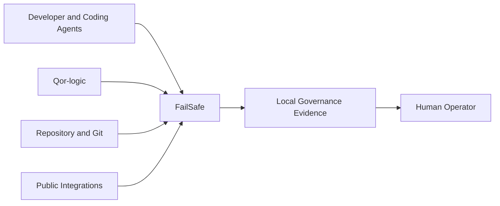

# FailSafe Ecosystem Position

## Role

FailSafe is the public, local-first VS Code and Cursor product for governing AI-assisted software development inside the editor and repository workspace.

It provides a focused experience for developers who need local governance, evidence, debugging, stability monitoring, integrations, and visible intervention without adopting a broader hosted platform.

## Position

The arrows describe current public inputs and outputs. They do not transfer authority from Qor-logic, an integration, or the human operator into FailSafe.

## Owns

- the shipped VS Code and Cursor extension behavior;
- editor-local governance interventions;
- developer-facing governance, evidence, replay, risk, and stability UX;
- supported host integrations;
- accessibility and local-first behavior;
- Marketplace and Open VSX identity;
- existing-user compatibility and support obligations;
- release and maintenance policy for the FailSafe product.

## Consumes

- Qor-logic lifecycle, skill, gate, policy, ledger, and Shadow Genome contracts;
- repository and source-control state;
- explicitly enabled public integrations;
- local validators and evidence providers;
- supported agent and editor protocols.

The versioned Qor-logic consumer adapter is the compatibility seam. Consumed artifacts must resolve to explicit states such as `ok`, `unavailable`, `malformed`, `unsupported`, or `stale`; compatibility must never be guessed into success.

## Public integration seams

FailSafe may integrate with systems such as:

- Bicameral for reviewed decisions, grounding, drift, and preflight context;
- Microsoft Agent Governance Toolkit installers or supported governance adapters;
- GitHub checks and repository workflows;
- issue trackers, security scanners, notifications, and supported MCP or agent clients;
- ACP and governed CLI agent paths;
- Sentry, SARIF, Slack, Teams, Jira, Linear, and other explicitly enabled sources.

Every integration is opt-in. An integration supplies data or enforcement at its declared boundary. It does not silently transfer product or semantic authority into FailSafe.

## SDLC coverage

| Stage | FailSafe surface |
| --- | --- |
| Plan | SHIELD planning, audit, and evidence workflow |
| Code | Editor governance, monitoring, governed agents, and local intervention |
| Review | GitHub checks, issue linkage, risk, and security evidence |
| Ship | Release gates, preflight, and marketplace release discipline |
| Operate | Runtime issue ingestion, notifications, replay, and transparency views |

## Does not own

- organization-wide actor, claim, admission, obligation, or release semantics;
- hosted tenant identity, subscriptions, billing, or fleet operations;
- certification or compliance conclusions;
- external agent-attestation or confidential-computing standards;
- the authority to reinterpret upstream Qor-logic contracts;
- unrelated product roadmaps merely because FailSafe integrates with them.

## Product lifecycle

FailSafe remains a supported product. Its lifecycle may eventually become feature-complete and maintenance-focused, while retaining:

- security fixes;
- critical and high-impact defect fixes;
- VS Code, Cursor, Marketplace, Open VSX, and dependency compatibility;
- accessibility fixes;
- documentation and installation continuity;
- bounded integration compatibility;
- existing-user support.

Feature completion is not retirement, archive, deletion, renaming, or abandonment.

## Immediate path forward

1. Complete current public commitments and stabilization work.
2. Preserve reliable Marketplace and Open VSX releases.
3. Move duplicated lifecycle meaning behind versioned Qor-logic contracts.
4. Publish compatibility information for supported agent, IDE, MCP, and governance integrations.
5. Keep public behavior local-first, opt-in, and explicit about degraded states.
6. Define evidence-backed criteria for a future feature-complete maintenance phase.
7. Continue security, accessibility, documentation, and host-compatibility work indefinitely.

## Public disclosure boundary

This public document describes FailSafe as it exists and is supported today. It does not announce private branding, product-transition, migration, or launch plans.