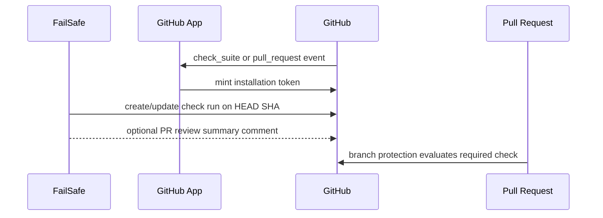
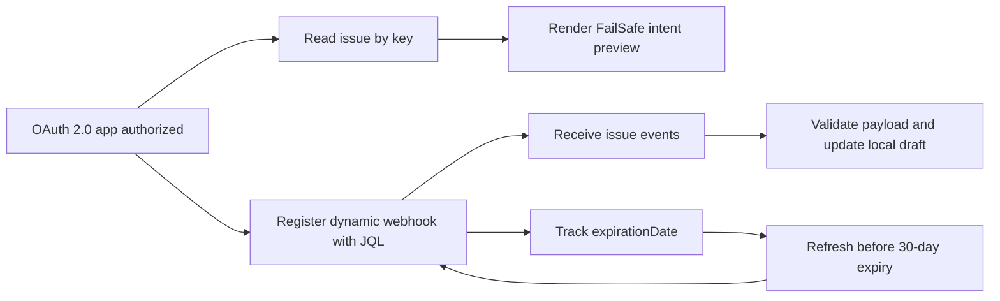
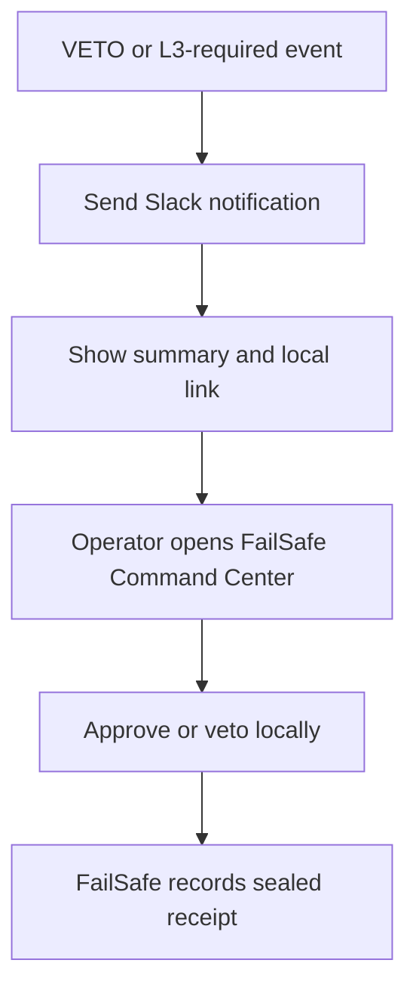
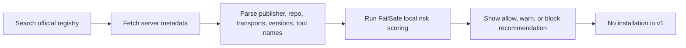

# ✅ Final FailSafe integration contract review packet

## Executive summary

The FailSafe issues define a clear split between integrations that are immediately implementable as **read-only evidence or notification adapters** and integrations that should remain in **research-first mode** because the upstream contract is either operationally fragile, version-sensitive, or misaligned with the issue’s initial assumption. Repo-grounded intent came from the open FailSafe integration issues for Open Design, GitHub PR checks, Linear, Jira, Semgrep/SARIF, Slack, Microsoft Teams, Sentry, Continue, OpenHands, Cline/Roo/Kilo, Aider, and the MCP Registry. citeturn10view0turn11view0turn11view1turn12view0turn12view1turn13view0turn13view1turn14view0turn14view1turn15view0turn15view1turn16view0turn16view1

The strongest near-term candidates are **GitHub App checks**, **Linear read-only issue import**, **offline SARIF ingestion with optional local Semgrep execution**, **Slack outbound notifications**, **Continue CLI headless wrapping**, **Aider diff-gated wrapping**, and **read-only MCP Registry scoring**. Those all have authoritative primary docs, narrow minimum-safe slices, and few truly blocking unknowns. citeturn11view0turn11view1turn12view1turn13view0turn14view1turn16view0turn16view1turn21search4turn21search1turn22search2turn21search3turn39view0turn23search3turn43search0turn43search2

The integrations that need the most contract care are **Open Design**, **Jira dynamic webhooks**, **Microsoft Teams Workflows**, **Sentry release correlation**, **OpenHands**, and **Cline/Roo/Kilo**. Open Design is the biggest surprise: the issue text says the correct v1 shape is REST/SSE and explicitly says it is “not an MCP server,” but upstream Open Design documentation now says the daemon still owns `/api/*` and SSE contracts **and** that Open Design also ships a read-only stdio MCP server. That creates a real design fork for FailSafe: daemon observer, MCP adapter, or dual-path support. citeturn10view0turn19view0turn19view1turn19view2turn19view3

The safest cross-cutting rule is to keep **all v1 integrations disabled by default**, never emit secrets into logs or receipts, never let notification failures block local governance decisions, and defer any action-taking remote workflow unless the vendor contract explicitly supports secure callback verification and least-privilege authorization. That matches the FailSafe issue acceptance criteria and the upstream auth and webhook models documented by GitHub, Atlassian, Slack, Teams, Linear, Sentry, and the MCP spec. citeturn11view0turn12view0turn13view0turn13view1turn33view2turn28view0turn25search2turn26view1turn37view2turn43search1

## Comparison matrix

| Issue | Candidate | Auth model | Minimum scopes or permissions | Webhook or lifecycle | Blocker status | Evidence |
|---|---|---|---|---|---|---|
| #95 | Open Design | Local daemon over loopback REST/SSE; optional stdio MCP registration | None for local observer; MCP inherits local file-read trust | SSE streams on `/api/*`; no public stable versioning surfaced | **Research drift**: issue assumption is stale because upstream now also ships MCP | citeturn10view0turn19view0turn19view1turn19view2turn19view3 |
| #96 | GitHub | GitHub App JWT → installation token | Checks write, Pull requests write, Metadata read; fallback commit-status path can use narrower status-only auth | `check_suite` / `check_run` / PR lifecycle; branch protection consumes checks or statuses | **Conditional ready**: needs org-approved GitHub App | citeturn11view0turn30search0turn30search4turn30search6turn30search10turn31search0turn31search1turn31search10 |
| #97 | Linear | Personal API key or OAuth 2.0; SDK available | `read` for import; admin only if managing webhooks | Webhooks are persistent; signature + timestamp validation required | **Ready** for read-only import | citeturn11view1turn21search1turn21search5turn21search9turn32search0turn32search3turn33view0turn33view1 |
| #98 | Jira | OAuth 2.0 app or Connect app for dynamic webhooks | `read:jira-work` plus `manage:jira-webhook`; granular webhook scopes also available | Dynamic webhooks expire after 30 days and must be refreshed | **Conditional**: app registration and renewal job required | citeturn12view0turn27view0turn27view1turn27view2turn28view0turn29search0 |
| #99 | Semgrep/SARIF | None for offline SARIF or `semgrep scan`; token for `semgrep ci`; optional GitHub token for SARIF upload | Local CE needs no account; GitHub upload needs repository auth and compatible SARIF | No vendor webhook needed in v1 | **Ready** for offline-first ingestion | citeturn12view1turn22search2turn34search2turn34search4turn34search8turn22search19turn35search10turn35search6 |
| #100 | Slack | Incoming webhook URL; full Slack app needed for interactive callbacks | Webhook URL only for notify; interactivity requires app setup and signing-secret verification | No renewal for notify-only path; callback path needs Request URL verification | **Ready notify-only**; **interactive approval blocked** in v1 | citeturn13view0turn21search3turn21search11turn25search2turn25search10turn25search11turn25search22 |
| #101 | Microsoft Teams | Workflow-generated webhook URL tied to owners | Webhook URL only for notify path; workflow ownership and connections matter operationally | Workflows can orphan without owner/co-owner; 28 KB limit; >4 req/s throttled | **Ready notify-only**; **remote approval blocked** for v1 | citeturn13view1turn26view0turn26view1turn26view2 |
| #102 | Sentry | Internal integration or personal token; OAuth 2 for third-party app path | Read-only path typically needs org/project/event/release scopes | Optional alert webhooks respond within 1 second; release correlation depends on release discipline | **Conditional**: useful only if releases and SCM integration are configured | citeturn14view0turn37view2turn37view3turn36search2turn36search3turn36search9turn38search0turn38search18turn38search25 |
| #104 | Continue | `CONTINUE_API_KEY` personal or org-scoped; local tool permission policy | No vendor scopes exposed in docs; runtime enforced by `--allow` / `--ask` / `--exclude` | No webhook requirement | **Ready with version pin** | citeturn14view1turn39view0turn39view1 |
| #105 | OpenHands | SDK-configured model credentials and tools | Confirmation policy and security analyzer govern actions | No webhook requirement; persisted state includes tools, MCP config, secrets | **Conditional**: start-of-run gating only; no mid-run tool mutation | citeturn15view0turn40view0turn40view1turn40view2 |
| #106 | Cline/Roo/Kilo | Local provider keys and local config; optional remote MCP auth per server | Product-specific allow/ask/deny or auto-approve settings | No vendor webhook requirement in v1 | **Ready for config audit**; **IDE interception still unverified** | citeturn15view1turn41view0turn41view1turn41view2turn41view4turn42view1turn42view2turn42view3turn42view4 |
| #107 | Aider | Local model-provider API keys; git repo trust boundary | No central scope model; wrapper must control git side effects | No vendor webhook requirement | **Conditional**: auto-commit suppression must be validated on pinned version | citeturn16view0turn23search3turn23search7turn23search15turn23search19 |
| #108 | MCP Registry | Public read for discovery; publishing uses registry auth methods and namespace verification | None for read-only search; publish path uses GitHub OAuth/OIDC, DNS or HTTP verification, and legacy JWT auth in official registry | Registry is preview; no install in v1 | **Ready read-only**; preview stability risk remains | citeturn16view1turn43search0turn43search2turn43search6turn43search5 |

## Collaboration and governance integrations

### docs/research/integrations/INTEGRATION_OPEN_DESIGN_CONTRACT_REVIEW.md

**Executive summary.** The FailSafe issue correctly targets Open Design’s local daemon and SSE-observer value, but the upstream contract has moved since the issue was opened. Open Design still documents a local daemon listening on `http://localhost:7456` with REST and SSE routes under `/api/*`, yet the current README and changelog also state that Open Design now ships a read-only stdio MCP server (`od mcp`) for external coding agents. That means FailSafe must decide whether this integration is a **daemon observer**, an **MCP registry/client adapter**, or a **dual-path implementation**. Until that decision is made, only a read-only daemon health/artifact observer is safe to implement. citeturn10view0turn19view0turn19view1turn19view2turn19view3

**Authoritative docs.** Use the Open Design architecture notes for daemon responsibilities and default loopback binding, the repository AGENTS file for contract ownership in `packages/contracts`, the README for the new stdio MCP server and security model, and the changelog entry that introduced `od mcp`. citeturn19view0turn19view1turn19view2turn19view3

**Authentication, permissions, and secrets.** The daemon path is local-first and, in the public docs reviewed, does not require a vendor OAuth flow for basic local observation. The MCP path is also local and read-only, but it explicitly grants any registered MCP client read access to local Open Design project files; upstream says to treat registration like installing a trusted extension. The daemon binds to `127.0.0.1` by default, and LAN exposure requires explicit `OD_BIND_HOST` opt-in; same-origin exceptions use `OD_ALLOWED_ORIGINS`, while connector-credential and live-artifact preview routes stay loopback-only. FailSafe therefore should not copy or persist upstream provider keys, should redact any `OD_*` environment variables in diagnostics, and should refuse non-loopback daemon targets unless an operator explicitly enables them. citeturn19view2turn20search3turn20search7

**Supported surface and lifecycle.** The daemon owns `/api/*`, maintains per-web-tab sessions, streams structured agent output over SSE, operates an artifact store, and exposes plugin lifecycle SSE via `/api/plugins/events`. The docs also say shared request and SSE DTOs are intended to live in `packages/contracts`, but those contracts are internal repo artifacts rather than a published, versioned API promise. Failure modes documented upstream include reverse-proxy buffering breaking SSE, and MCP calls failing with a clear “daemon not reachable” error if the daemon is offline. citeturn19view0turn19view1turn20search2turn20search3turn20search7

**Evidence mapping to FailSafe intent.** The issue asks for daemon detection, read-only REST/SSE observation, transparency-event translation, and an L3 gate before finalize/export. That still fits the daemon contract well. What no longer fits is the issue’s assertion that Open Design is “not an MCP server”; that is now stale, so FailSafe should record a contract-drift note in the packet and keep v1 tightly scoped to local daemon status plus read-only event capture. citeturn10view0turn19view2turn19view3

**Threat posture, minimum slice, tests, blockers, checklist.** The main threats are local privileged daemon access, artifact exfiltration through too-broad observation, and remote exposure if loopback defaults are relaxed. Minimum safe slice: detect daemon/version, subscribe to SSE, surface project/artifact state, and never invoke finalize/export until an explicit local L3 path is designed. Validation should cover absent daemon, stale daemon version, SSE reconnect after dropped stream, reverse-proxy buffering, and versioned fixture snapshots for any parsed event union. The primary blocker is the architectural decision between daemon-only, MCP-only, or dual-path support; the second blocker is the absence of a formal public versioned API contract. citeturn10view0turn19view0turn19view1turn19view2turn20search7

**Short implementation checklist.**
- [ ] Pin a tested Open Design version or commit range.
- [ ] Implement loopback-only daemon health probe.
- [ ] Add SSE observer with reconnection and event-shape validation.
- [ ] Emit FailSafe transparency receipts from read-only events.
- [ ] Defer finalize/export and all write surfaces.

### docs/research/integrations/INTEGRATION_GITHUB_CONTRACT_REVIEW.md

**Executive summary.** This is the strongest collaboration integration in the set. GitHub’s Checks API exists specifically for rich PR gate feedback, but creating check runs is GitHub-App-centric: GitHub documents installation-token auth for Apps, the Checks API is exclusive to GitHub Apps for creation/update flows, and protected branches can require either checks or commit statuses. FailSafe should therefore implement a **GitHub App primary path** and keep a **commit status fallback** only if the organization cannot provision an App. citeturn11view0turn30search0turn30search4turn30search10turn31search0turn31search1turn31search10

**Authoritative docs.** The core docs are GitHub App authentication and installation tokens, Checks API usage, check-run endpoints, pull-request reviews, status checks, required-status-check behavior, and GitHub App rate limits. citeturn30search0turn30search3turn30search4turn21search16turn21search12turn31search1turn31search4turn30search5

**Authentication, permissions, and secrets.** GitHub Apps authenticate as the app using a JWT and then mint installation access tokens for repository operations. Tokens can only exercise permissions granted to the App. For FailSafe’s v1 scope, the smallest practical permission set is **Metadata read**, **Checks write**, and **Pull requests write** if posting review summaries. If the org will not allow an App, a fallback commit-status path can use the narrower status API instead of checks, but that loses annotations and richer UX. Secrets to store are the App private key, App ID, installation ID lookup data, and any webhook secret if FailSafe receives GitHub events. All of them should be kept out of logs and never written to receipts. citeturn30search0turn30search3turn30search6turn31search0turn31search1

**Supported surface, lifecycle, and rate limits.** GitHub automatically creates check suites on pushes and sends the `check_suite` event to Apps with `checks:write`; the App can then create check runs for the latest SHA. Pull-request reviews can publish `COMMENT`, `REQUEST_CHANGES`, or `APPROVE`, but line comments require diff-position mapping, which the issue explicitly wants to defer. GitHub also notes that checks created in one repository do not track pushes in a forked repository, and the `pull_requests` array can come back empty for fork scenarios. GitHub Apps are subject to primary and secondary rate limits, so FailSafe should batch updates and avoid chatty retry loops. GitHub also auto-deletes older check runs once more than 1,000 runs with the same name accumulate in a check suite. citeturn11view0turn30search4turn21search12turn21search16turn30search5turn31search13

**Evidence mapping to FailSafe intent.** The issue’s “single FailSafe check result on HEAD SHA” is exactly the right minimum slice. One deterministic mapping of PASS/WARN/VETO to GitHub conclusions is enough for day one; line annotations and multi-comment review formatting should wait until diff-position mapping is proven. citeturn11view0turn31search10

This flow matches GitHub’s App-authenticated checks model and the FailSafe issue’s desired merge-gate posture. citeturn11view0turn30search0turn30search4turn31search10

**Threat posture, minimum slice, tests, blockers, checklist.** Threats are over-broad repository permissions, accidental posting to the wrong repo/SHA, and fork edge cases that mislead operators about coverage. Minimum safe slice: local git remote/branch/SHA detection, one check run on HEAD, and optional non-inline PR summary after the check path is stable. Validation should cover disabled integration, missing installation token, protected-branch consumption, fork PRs, secondary-rate-limit handling, and deterministic status-conclusion mapping. The only real blocker is org-level App provisioning; technically, the contract is mature. citeturn11view0turn30search5turn31search13

**Short implementation checklist.**
- [ ] Register a GitHub App with least privilege.
- [ ] Implement installation-token lookup and caching.
- [ ] Post one named check run per HEAD SHA.
- [ ] Add optional PR summary review, not line comments, in v1.
- [ ] Cover fork and disabled-integration degrade paths.

### docs/research/integrations/INTEGRATION_LINEAR_CONTRACT_REVIEW.md

**Executive summary.** Linear is well suited for a read-only intent-import integration because its public GraphQL API, TypeScript SDK, OAuth 2.0 flow, and webhook security story are all clearly documented. FailSafe’s v1 should use issue URL or ID import first and keep webhook sync optional. citeturn11view1turn21search1turn33view1turn32search0

**Authoritative docs.** Use Linear’s Developers hub, GraphQL getting-started docs, OAuth 2.0 auth docs, TypeScript SDK docs, webhook docs, and rate-limiting docs. citeturn21search1turn21search5turn32search3turn33view1turn33view2turn33view0

**Authentication, permissions, and secrets.** Linear supports personal API keys and OAuth 2.0. Workspace admins can control whether members can create keys; keys can be limited by permission class and even restricted to specific teams. OAuth is the better long-term choice if FailSafe will be used by multiple operators or service accounts, and Linear now uses refresh tokens in the new system. Access tokens are valid for 24 hours, refresh tokens rotate, and Linear documents a 30-minute grace period for refresh-token replay after network failures. Store only the token pair and client secret in a secret store; never persist webhook signing secrets or access tokens in receipts. citeturn32search1turn32search3

**Supported surface, lifecycle, and rate limits.** The API is GraphQL-first, and the SDK exposes typed models and operations via `@linear/sdk`. That is sufficient for issue title, description, state, priority, labels, assignee, and linked entities. Webhooks support change events for issues, comments, attachments, documents, projects, cycles, labels, users, and SLAs. Linear signs webhooks with an HMAC-SHA256 `Linear-Signature` header and recommends validating the signed raw body as well as rejecting timestamps older than one minute to mitigate replay. The API also exposes request count and complexity headers. One important contract gap: Linear’s rate-limit page contains a doc inconsistency for API-key request limits, stating “up to 5,000 requests per hour” in one paragraph while the table below lists “2,500” for API keys and “5,000” for OAuth apps. FailSafe should therefore respect response headers and never hardcode a single API-key ceiling. citeturn33view1turn33view2turn33view0

**Evidence mapping to FailSafe intent.** The issue asks for visible intent preview before persistence, graceful no-auth failure, and optional webhook read-only sync. The Linear contract maps directly onto that plan. There is no reason to start with mutating operations. citeturn11view1turn32search1

**Threat posture, minimum slice, tests, blockers, checklist.** Threats are over-scoped personal keys, cross-team data exposure from unrestricted keys, replayed webhook payloads, and overly complex GraphQL queries that waste quota. Minimum safe slice: accept issue URL or ID, fetch canonical fields, present an uncommitted intent preview, and stop there. Validation should cover invalid issue IDs, revoked tokens, restricted-team keys, signature mismatch, stale webhook timestamp, and rate-limit header parsing. The main non-technical blocker is whether the target Linear workspace admins will allow key creation or OAuth app installation; otherwise, there is no protocol blocker. citeturn11view1turn32search1turn32search3turn33view0turn33view2

**Short implementation checklist.**
- [ ] Start with read-only OAuth or team-scoped API key.
- [ ] Resolve Linear issue URL/ID to canonical issue node.
- [ ] Build intent preview without auto-persist.
- [ ] Treat webhooks as optional phase two.
- [ ] Honor rate-limit headers and complexity ceilings dynamically.

### docs/research/integrations/INTEGRATION_JIRA_CONTRACT_REVIEW.md

**Executive summary.** Jira issue import is implementable now. Jira **dynamic webhook sync** is also implementable, but only if FailSafe is willing to become an Atlassian app client with renewal logic. Atlassian’s own docs are explicit: only Connect and OAuth 2.0 apps can register and manage dynamic webhooks, and those webhooks expire after 30 days unless refreshed. That makes “read-only issue fetch first, dynamic webhook second” the right plan. citeturn12view0turn27view0turn28view0

**Authoritative docs.** Use the Jira Cloud Webhooks guide, the REST v2/v3 webhook reference, the OAuth/Forge scope reference, and the Jira rate-limiting guide. citeturn27view1turn27view0turn27view2turn29search0

**Authentication, permissions, and secrets.** For read-only issue import, FailSafe can operate with a Jira Cloud OAuth 2.0 app using `read:jira-work`. For dynamic webhooks, Atlassian documents the `manage:jira-webhook` scope, plus read scopes for JQL/webhook retrieval. Connect apps use their own scope model, but for a modern integration FailSafe should standardize on 3LO unless an enterprise already has Connect or Forge policy in place. Store the site base URL, client credentials, refresh tokens, and per-tenant webhook IDs; do not assume custom-field schemas or admin permissions are uniform across customer sites. citeturn27view0turn27view2

**Supported surface, lifecycle, and rate limits.** Jira webhooks are JQL-scoped and can notify on issue events, while the webhook API also exposes listing, deletion, failed-delivery retrieval, and explicit refresh. The crucial lifecycle rule is that REST-registered webhooks expire after 30 days and must be refreshed, with the refresh endpoint returning the next expiration date. Jira Cloud now also applies burst and points-based rate limiting; exceeding per-endpoint burst capacity yields HTTP 429, and Atlassian explicitly recommends robust backoff. This means FailSafe needs a renewal scheduler and a 429-aware client before treating webhooks as production-grade. citeturn12view0turn27view0turn28view0turn29search0

This is the correct lifecycle if FailSafe decides to support Jira dynamic webhooks rather than polling. citeturn27view0turn28view0

**Evidence mapping to FailSafe intent.** The issue’s acceptance criteria already anticipate Jira’s hardest problem: custom fields. That is exactly right. FailSafe should import only canonical issue fields plus a transparent “raw unmapped fields” section, not attempt schema normalization in v1. citeturn12view0

**Threat posture, minimum slice, tests, blockers, checklist.** Threats are admin-only scope creep, custom-field over-assumptions, stale webhook renewal, and 429 retry storms. Minimum safe slice: read issue by key, preview canonical fields, and record source URL. Optional phase two: dynamic webhooks for a tightly scoped JQL filter with tracked expiration. Tests should cover missing fields, unknown custom fields, revoked OAuth credentials, 429 handling, payload validation, webhook refresh scheduling, and stale webhook IDs. The main blocker is operational, not technical: app registration, tenant admin consent, and renewal scheduling must be in place before webhook sync can be treated as reliable. citeturn12view0turn27view0turn29search0

**Short implementation checklist.**
- [ ] Ship read-only issue import before any webhook work.
- [ ] Use canonical fields plus transparent “unmapped data.”
- [ ] If webhooks are added, track expiry and refresh proactively.
- [ ] Handle 429 with exponential backoff and jitter.
- [ ] Document tenant-admin consent requirements up front.

### docs/research/integrations/INTEGRATION_SLACK_CONTRACT_REVIEW.md

**Executive summary.** Slack is straightforward for **notification-only** use and unsuitable for **webhook-only approvals**. Incoming webhooks post nicely formatted text and Block Kit messages, but actual interaction handling requires Slack app interactivity and signed callback verification. That aligns with the issue’s own v1 stance: post governance cards, but route approval decisions back to the local Command Center rather than trying to execute remote approval in Slack. citeturn13view0turn21search3turn25search10turn25search2

**Authoritative docs.** Use Slack’s incoming-webhook docs, Block Kit docs, interactivity overview, interaction-handling docs, and request-verification docs. citeturn21search3turn25search11turn21search11turn25search10turn25search2

**Authentication, permissions, and secrets.** For notification-only v1, the credential is the webhook URL. For any real remote action approval, you would need a full Slack app with interactivity enabled, a Request URL, and signature verification using the app’s signing secret. Because the integration issue explicitly says approval buttons should link back locally, FailSafe should not request bot-token scopes or interactivity setup in the first implementation slice. Secret handling should treat the webhook URL as sensitive, mask it in settings, rotate by replacing it if exposed, and never include raw prompts, stack traces, or secrets in channel payloads. The last point is FailSafe’s recommendation, consistent with the issue’s privacy acceptance criteria. citeturn13view0turn21search3turn25search2turn25search10

**Supported surface, lifecycle, and failure modes.** Incoming webhooks accept JSON payloads with text and blocks, and Block Kit messages can contain buttons and other UI. But without app interactivity configured, those elements are presentation only from FailSafe’s perspective. Slack’s message surface allows up to 50 blocks in a message, which is more than enough for concise governance alerts. The main failure modes for v1 are leaked webhook URLs, malformed blocks, and transient POST failures. Since the vendor contract does not make incoming webhook delivery a transactional guarantee, FailSafe should treat Slack as an asymmetric best-effort notification sink. citeturn21search3turn25search11turn25search10

**Evidence mapping to FailSafe intent.** The issue asks for VETO, L3 queued, L3 decided, release-seal, and critical-drift notices, with no remote approval action in v1. That is precisely the safest reading of Slack’s webhook contract. citeturn13view0

This link-back design keeps Slack purely informational until a fully verified interactivity path is justified. citeturn13view0turn25search10turn25search2

**Threat posture, minimum slice, tests, blockers, checklist.** Threats are channel oversharing, spoofed interaction endpoints if interactivity is later added incorrectly, and treating message delivery as a governance dependency. Minimum safe slice: concise outbound notifications only. Tests should cover masked-secret config display, payload rendering, fallback text, malformed payload handling, and non-blocking behavior on POST failure. The blocker for remote approval is real and explicit: incoming webhooks are not enough; that path needs a Slack app, interactivity, and callback verification. citeturn13view0turn25search2turn25search10turn25search22

**Short implementation checklist.**
- [ ] Support outbound webhook URL only in v1.
- [ ] Keep cards concise and non-sensitive.
- [ ] Use buttons only as links back to FailSafe, not action callbacks.
- [ ] Make failures non-blocking and observable.
- [ ] Defer full Slack app interactivity to a separate issue.

### docs/research/integrations/INTEGRATION_MICROSOFT_TEAMS_CONTRACT_REVIEW.md

**Executive summary.** Teams supports a solid notification path through **Workflows-generated incoming webhooks**, but the contract is operationally weaker than Slack because workflows are owner-linked, can orphan without co-owners, and have explicit payload and throughput limits. In addition, current official docs say workflows support Adaptive Cards and Message Card format, but button rendering is not supported in that workflow path. That makes link-back approval the only safe v1 design. citeturn13view1turn26view0turn26view1turn26view2

**Authoritative docs.** Use Microsoft Learn’s incoming-webhook via Workflows docs and the Teams webhooks/connectors overview. citeturn26view0turn26view1turn26view2

**Authentication, permissions, and secrets.** The outbound sender needs only the generated webhook URL, but the operational trust boundary is larger because the workflow belongs to one or more owners and may also depend on workflow connections if it evolves. The docs explicitly warn that workflows are linked to specific users, not to a team or channel, and can become orphan flows without co-owners. FailSafe should therefore require operators to document an owner plus at least one co-owner before enabling Teams notifications in shared production environments. The webhook URL itself must be treated as a secret. citeturn26view1turn26view2

**Supported surface, lifecycle, rate limits, and failure modes.** Workflows can receive HTTP POST requests and post messages or Adaptive Cards to channels or chats. Microsoft documents a **28 KB** message-size limit and throttling if more than **four requests per second** hit the webhook, recommending retry logic with exponential backoff. The same page also says new Microsoft 365 connectors are nearing deprecation, so Workflows is the forward path. Practical failure modes include payloads that are too large, throttling, owner departure, and private-channel limits for flow-bot posting still being under development. citeturn26view0turn26view1turn25search0

**Evidence mapping to FailSafe intent.** The issue’s desired first slice—VETO, L3 queued/decided, release seal, and critical drift, with no remote approval callback—is exactly what the Teams workflow contract can support safely right now. citeturn13view1

**Threat posture, minimum slice, tests, blockers, checklist.** Threats are webhook leakage, silent workflow orphaning, dropped or throttled notifications during incident bursts, and falsely assuming Teams card buttons can execute governance actions. Minimum safe slice: outbound notifications only, payloads under 28 KB, exponential backoff, and an operational enablement checklist requiring co-owners. Tests should cover payload-size budget checks, 429-style throttling responses, disabled integration, and recovery after owner changes. The blocker status is “notify-ready, approval-blocked”: Teams is a good visibility sink, not yet a safe governance action surface for FailSafe. citeturn13view1turn26view1turn26view2

**Short implementation checklist.**
- [ ] Require workflow owner and co-owner before enablement.
- [ ] Keep payloads well below 28 KB.
- [ ] Implement 4 req/s-aware backoff.
- [ ] Use cards for visibility and links only.
- [ ] Explicitly avoid remote approval actions in v1.

## Security and observability integrations

### docs/research/integrations/INTEGRATION_SEMGREP_SARIF_CONTRACT_REVIEW.md

**Executive summary.** This is one of the cleanest integrations in the set because FailSafe can start with **offline SARIF import** and add **local Semgrep execution** later. Semgrep Community Edition can be installed and run locally without an account, can emit SARIF and JSON, and SARIF itself is a vendor-neutral OASIS standard that GitHub code scanning also accepts as a subset of SARIF 2.1.0. citeturn12view1turn22search2turn22search14turn22search19turn35search10

**Authoritative docs.** Use Semgrep’s local CLI docs, CLI reference, customization/output docs, CE-in-CI docs, and GitHub’s SARIF/code-scanning docs for optional upload compatibility. citeturn22search2turn22search6turn34search2turn34search8turn35search10turn35search2turn35search6

**Authentication, permissions, and secrets.** `semgrep scan` requires no account for local scans. `semgrep ci` may require login or a `SEMGREP_APP_TOKEN` when using Semgrep AppSec Platform organization policies. That gives FailSafe a natural secret-minimizing rollout: offline import first, local `semgrep scan` next, Semgrep platform integration last. If GitHub upload is later desired, GitHub also requires repository access and syntactically valid SARIF for upload. citeturn22search2turn34search6turn35search10turn35search6

**Supported surface, lifecycle, and failure modes.** Semgrep can emit SARIF and JSON directly. A key operational nuance is exit-code behavior: `semgrep scan` and `semgrep ci` finish with exit code `0` when a scan completes unless you configure blocking rules or use error flags, while blocking findings in CI produce exit code `1`. That matters because FailSafe should not infer “no findings” from process exit alone. SARIF imports must be syntactically valid, and GitHub only supports a subset of SARIF 2.1.0 for code scanning ingestion. The strongest v1 design is therefore: parse SARIF as data, compute FailSafe risk records locally, and only later consider invoking scanners or publishing results elsewhere. citeturn34search4turn34search13turn22search19turn35search10turn35search6

**Evidence mapping to FailSafe intent.** The issue’s first safe slice—import a SARIF file from disk, parse rule/severity/path/region/tool metadata, and upsert risks with provenance—is exactly the best implementation order. The CLI runner is phase two, not phase one. citeturn12view1

**Threat posture, minimum slice, tests, blockers, checklist.** Threats are malformed SARIF causing parser crashes, path confusion, duplicate finding storms, and accidental dependence on scanner-specific semantics that do not generalize across SARIF producers. Minimum safe slice: offline SARIF parser with strict schema validation, stable dedup keys, and explicit provenance fields. Testing should include a Semgrep CE SARIF fixture, malformed files, duplicate imports, missing region data, GitHub-compatible subset validation, and confirm that waived findings need an explicit operator action. There is no meaningful blocker for this slice. citeturn12view1turn34search2turn35search6turn35search10

**Short implementation checklist.**
- [ ] Implement strict SARIF 2.1.0 parser with fixture-based tests.
- [ ] Upsert findings with stable dedup keys and provenance.
- [ ] Keep local import independent of Semgrep account features.
- [ ] Add optional local Semgrep runner after parser stabilizes.
- [ ] Defer GitHub SARIF upload to a separate feature flag.

### docs/research/integrations/INTEGRATION_SENTRY_CONTRACT_REVIEW.md

**Executive summary.** Sentry can provide high-value post-deployment evidence, but only if the target organization already has release discipline and linked source control. The raw API contract is strong: Sentry documents auth tokens, scopes, release endpoints, commit listing, changed-file retrieval, suspect commits, and SCM integrations. The actual blocker is data quality, not protocol support. citeturn14view0turn37view2turn37view3turn38search0turn38search18turn38search25

**Authoritative docs.** Use Sentry API auth docs, permission/scope docs, release API reference, release-health docs, SCM/GitHub integration docs, suspect-commit docs, and webhook docs if alerts are ever added. citeturn37view2turn37view3turn22search9turn22search13turn36search9turn38search1turn36search2

**Authentication, permissions, and secrets.** Sentry recommends organizational auth tokens via internal integrations when possible. Scope mapping is explicit: read org data with `org:read`, projects with `project:read`, issues/events with `event:read`, and releases with `project:releases`; CI and release automation may also use `org:ci`. OAuth is available for third-party applications, but its access tokens expire after 30 days and are organization-scoped to the org chosen during the flow. For a read-only FailSafe integration, internal integration tokens are the better fit. Store only token material and known org/project identifiers; do not persist raw event payloads unless explicitly enabled. citeturn37view2turn37view3turn36search8

**Supported surface, lifecycle, and rate limits.** Sentry’s Releases API exposes releases, release commits, changed files in release commits, deploys, and health/session statistics. Product docs also explain that releases help identify regressions and connect new issues to deployments. Suspect commits are surfaced when source-code integrations and commit tracking are configured. Sentry rate-limits API requests per caller-endpoint combination with both request-per-second and concurrent-request controls. If alert webhooks are later added, Sentry’s webhook contract expects a response within one second. citeturn22search9turn38search0turn38search18turn38search13turn36search3turn36search2turn38search25

**Evidence mapping to FailSafe intent.** The issue proposes a mapping of issue → release → commit/PR → FailSafe risk. That is feasible when release versions are consistently created and linked to repositories; otherwise, the same code path will return partial evidence, such as issue timing without suspect commits or file lists. citeturn14view0turn38search0turn38search18turn38search25

**Threat posture, minimum slice, tests, blockers, checklist.** Threats are overscoped tokens, accidental ingestion of sensitive raw event data, noisy runtime signals without release context, and webhook timeouts if alert callbacks are ever added. Minimum safe slice: read-only import of issues plus release metadata, first/last seen, environment, release version, suspect commit when present, and changed files when available. Tests should cover missing release linkage, missing suspect commits, rate-limit handling, org/project-scope errors, and self-hosted Sentry URL overrides if required. The main blocker is organizational maturity: without release naming discipline and SCM integration, FailSafe cannot guarantee strong regression correlation. citeturn14view0turn36search3turn36search9turn38search13

**Short implementation checklist.**
- [ ] Use internal integration token with least read scopes.
- [ ] Import issue, release, commit, and changed-file evidence only.
- [ ] Redact or drop raw event bodies by default.
- [ ] Detect and surface “correlation incomplete” states clearly.
- [ ] Treat webhooks as optional and time-budgeted if added later.

## Agent runtime integrations

### docs/research/integrations/INTEGRATION_CONTINUE_CONTRACT_REVIEW.md

**Executive summary.** Continue CLI is a strong v1 wrapper target because headless mode, API-key auth, structured output, and explicit tool-permission controls are all documented. The main caveat is documentation drift around the exact `--allow` grammar, which should be resolved by pinning the tested Continue CLI version and exercising it in contract tests. citeturn14view1turn39view0turn39view1

**Authoritative docs.** Use the Continue CLI guide, the headless-mode page, and the general Continue docs explaining checks and status-check integration. citeturn39view1turn39view0turn39view2

**Authentication, permissions, and secrets.** Continue documents `CONTINUE_API_KEY` for CI and headless automation, with both personal and organization-scoped API keys supported. Tool permissions are controlled by CLI flags and persistent preferences written to `~/.continue/permissions.yaml`. The wrapper should set credentials only through environment injection, never as command-line arguments, because CLI arguments are easy to leak through process listings and logs. That last point is a FailSafe implementation recommendation derived from the product’s documented environment-variable auth path. citeturn39view0turn39view1

**Supported surface, lifecycle, and failure modes.** `cn -p` executes a single headless task, can emit structured JSON with `--format json`, can resume prior sessions, and in headless mode automatically excludes tools that would normally require interactive approval unless explicitly allowed. That is exactly what FailSafe wants for a controlled wrapper. The contract gap is subtle but important: one Continue doc shows `--allow Write --allow Edit`, while another shows `--allow Write()` and Bash filters like `Bash(curl*)`. That syntax mismatch is enough reason to pin a known-good version and add spawn-level contract tests before shipping. Continue also writes verbose logs to `~/.continue/logs/cn.log`, so FailSafe must ensure secrets and prompts are not echoed there during guarded runs. citeturn39view0turn39view1

**Evidence mapping to FailSafe intent.** The issue’s desired slice—detect `cn`, run prompt through a wrapper, map allowlist to risk tier, capture stdout/JSON/diff/exit status, and block writes unless mode permits—is directly supported by the documented headless and permission model. citeturn14view1turn39view0turn39view1

**Threat posture, minimum slice, tests, blockers, checklist.** Threats are over-broad `--allow "*"`, Bash/write side effects, API-key leakage through logs, and hidden syntax drift in a fast-moving CLI. Minimum safe slice: read-only or no-tool wrapper first, then explicit `Write`/`Edit` allow paths only after version-pinned validation. Tests should cover missing binary, invalid API key, no-tool mode, write-allowed mode, JSON output parsing, and permissions-syntax contract tests against the pinned CLI. There is no platform blocker, but there is a clear version-pin requirement. citeturn14view1turn39view0turn39view1

**Short implementation checklist.**
- [ ] Pin a Continue CLI version in tests.
- [ ] Use `CONTINUE_API_KEY` via env only.
- [ ] Start with no-tool or read-only tool profile.
- [ ] Validate actual `--allow` grammar on the pinned version.
- [ ] Parse JSON output and redact logs.

### docs/research/integrations/INTEGRATION_OPENHANDS_CONTRACT_REVIEW.md

**Executive summary.** OpenHands is viable as an observer/governor, but only if FailSafe accepts OpenHands’ core session rule: the tool set is part of the system prompt and cannot be changed mid-conversation. That means FailSafe must gate **conversation start**, not attempt dynamic policy mutation during a live run. citeturn15view0turn40view0

**Authoritative docs.** Use the OpenHands SDK agent API reference, the security/action-confirmation guide, and the persistence guide. citeturn40view0turn40view1turn40view2

**Authentication, permissions, and secrets.** OpenHands is SDK-centric rather than SaaS-auth-centric in the reviewed docs. The relevant controls are model credentials, tool lists, MCP config, confirmation policy, and security analyzer configuration. One very important secret-handling concern comes from persistence: OpenHands’ persisted conversation state can include tools, MCP servers, tool outputs, workspace context, and **secrets**. If FailSafe enables persistence-aware observation, it must treat the persistence directory as sensitive data and either encrypt it, isolate it, or disable persistence for higher-risk runs. citeturn40view1turn40view2

**Supported surface, lifecycle, and failure modes.** OpenHands documents confirmation policies such as `AlwaysConfirm`, `NeverConfirm`, and `ConfirmRisky`, plus security analyzers that score action risk. Conversations can be persisted and resumed. But the SDK explicitly verifies that tools must match exactly when resuming from persisted state; if they do not, verification fails. This is not a nuisance—it is the core runtime contract. The correct FailSafe adapter stance is therefore: observe events, set confirmation/security policy before execution, and if the policy changes materially, fork or start a new conversation instead of mutating a live one. citeturn40view0turn40view1turn40view2

**Evidence mapping to FailSafe intent.** The issue’s proposed safe slice—read-only observer, transparency stream, start-of-run tool policy gate—is exactly what the OpenHands docs support. The acceptance criterion that tool-policy changes must start a new conversation is also directly validated by the upstream contract. citeturn15view0turn40view0

**Threat posture, minimum slice, tests, blockers, checklist.** Threats are secret persistence, unnoticed drift between persisted and runtime tool sets, and confirmation policies that are too permissive for shell/file operations. Minimum safe slice: event observer plus startup policy gate using confirmation and security analyzer settings, with persistence either disabled or isolated. Tests should cover resume with matching tools, resume with mismatched tools, action rejection feedback, persistence directory hygiene, and unsupported-version degradation. The blocker is conceptual, not technical: FailSafe cannot promise mid-run policy mutation because OpenHands explicitly does not support it. citeturn15view0turn40view0turn40view1turn40view2

**Short implementation checklist.**
- [ ] Gate policy before conversation start.
- [ ] Default to confirm-risky or stricter policy profiles.
- [ ] Treat persistence directories as sensitive.
- [ ] Reject mid-run policy mutation and require fork/new conversation.
- [ ] Map OpenHands events to FailSafe transparency schema.

### docs/research/integrations/INTEGRATION_CLINE_ROO_KILO_CONTRACT_REVIEW.md

**Executive summary.** Issue #106 is best interpreted as a **config-audit and local-risk-detection** integration, not a deep runtime interception project. Across Cline, Roo, and Kilo, the stable, documented common ground is MCP configuration, auto-approval controls, and local permission state. That is enough for a valuable FailSafe v1 that detects risky MCP servers, wildcard or persistent auto-approval, and shell-capable tooling. citeturn15view1turn41view1turn42view1turn42view3turn42view4

**Authoritative docs.** Use Cline overview, Cline MCP docs, Cline auto-approve docs, Cline SDK and CLI docs, Roo MCP and auto-approve docs, and Kilo MCP plus permission docs. citeturn41view0turn41view1turn41view2turn41view3turn41view4turn42view1turn42view2turn42view3turn42view4

**Authentication, permissions, and secrets.** None of these products exposes a single enterprise auth model in the reviewed docs; instead they rely on local provider credentials plus local config files. Cline supports local and remote MCP servers, with manual config in `~/.cline/mcp.json` for CLI and extension-managed MCP JSON in IDEs. Roo uses global `mcp_settings.json` and optional project `.roo/mcp.json`, including `env`, `alwaysAllow`, and `disabled`. Kilo uses the same conceptual allow/ask/deny model for built-in and MCP tools, namespacing MCP permissions as `{server}_{tool}`. FailSafe should treat all of these files as potentially secret-bearing and redact env values on parse. citeturn41view1turn42view3turn42view1turn42view2

**Supported surface, lifecycle, and contract gaps.** Cline documents MCP marketplace/manual config and supports both local stdio and remote HTTP/SSE servers. Roo supports global and project-level MCP config, and its auto-approve path for MCP tools uses a two-step permission model: global enable plus per-tool allow. Kilo likewise uses namespaced allow/ask/deny policy for MCP tools. The most important contract gap sits in Cline’s own docs: the high-level overview says “every action requires your explicit approval,” but the CLI reference says the default prompt starts in act mode with auto-approve enabled. FailSafe should interpret that as a documentation tension and **never assume safe defaults in Cline CLI**; explicitly set or override approval state in any wrapper or audit explanation. citeturn41view0turn41view4turn42view3turn42view4turn42view2

**Evidence mapping to FailSafe intent.** The issue’s first safe slice—detect installed products/config files, read MCP and permission config, and flag risky auto-approval or remote MCP use—aligns extremely well with the upstream docs. The issue also wisely defers direct IDE interception until extension APIs are verified, and nothing in the reviewed docs removes that blocker. citeturn15view1turn41view1turn42view3turn42view4

**Threat posture, minimum slice, tests, blockers, checklist.** Threats are wildcard or persistent auto-approval, remote MCP servers with unknown auth posture, shell/file tools exposed through MCP, and plaintext provider secrets in config. Minimum safe slice: read-only config parser and risk scorer only. Tests should cover missing config, server namespacing, redaction of env values, project-overrides-global precedence for Roo, namespaced MCP permission parsing for Kilo, and Cline remote transport detection. The blocker for anything deeper than auditing is the lack of a verified stable interception API across the IDE surfaces. citeturn15view1turn41view1turn42view1turn42view3turn42view4

**Short implementation checklist.**
- [ ] Implement read-only parsers for Cline, Roo, and Kilo configs.
- [ ] Redact env values and tokens on ingest.
- [ ] Flag remote transports, wildcard allows, and shell-capable tools.
- [ ] Treat Cline CLI defaults as unsafe until explicitly set.
- [ ] Defer runtime interception and extension patching.

### docs/research/integrations/INTEGRATION_AIDER_CONTRACT_REVIEW.md

**Executive summary.** Aider is a good low-cost wrapper target because its docs clearly establish command-line scripting, Python scripting, file-scoped editing, and tight git integration. The one contract gap that matters for FailSafe is how to **reliably disable or override auto-commit** on the exact pinned version being integrated. The docs we reviewed confirm Aider’s git integration and scripting surface, but not the exact suppression flag spelling for the current release, so that must be validated in contract tests before shipping. citeturn16view0turn23search3turn23search7turn23search15turn23search19

**Authoritative docs.** Use Aider’s homepage, usage docs, scripting docs, options reference, and FAQ. citeturn23search7turn23search19turn23search3turn23search15turn23search23

**Authentication, permissions, and secrets.** Aider relies on local model-provider credentials and local git repository state, not a separate SaaS auth model. The safe pattern is the same as with Continue: inject provider keys through env only, never through command-line flags, and keep the wrapper responsible for repo-path allowlisting and dirty-worktree refusal rules. Aider is explicitly scriptable from both the command line and Python, so FailSafe has multiple wrapper options. citeturn23search3turn23search15

**Supported surface, lifecycle, and failure modes.** Aider can execute one-shot natural-language instructions via `--message`, edits only files added to the chat, and has built-in git integration with automatic commits. That is useful for normal users, but dangerous for FailSafe because it can bypass the intended diff gate if not controlled. The right v1 posture is to capture before/after diffs, treat non-zero exits as first-class evidence, and refuse dirty worktrees unless explicitly allowed. Because the docs in scope do not fully confirm the current no-auto-commit switch semantics, that should remain a pre-implementation validation item rather than an assumption. citeturn23search3turn23search7turn23search19

**Evidence mapping to FailSafe intent.** The issue’s desired safe slice—detect binary, verify git state, run through a wrapper, capture diff, and keep auto-commit off unless configured—is exactly the right governance model for Aider. citeturn16view0

**Threat posture, minimum slice, tests, blockers, checklist.** Threats are implicit git commits, operation on dirty worktrees, accidental scope expansion when too many files are added, and API-key leakage. Minimum safe slice: one-shot wrapper with diff capture and no automatic commit acceptance. Tests should cover missing binary, missing git repo, dirty-worktree refusal, clean-run diff capture, non-zero exits, and verified suppression of auto-commit on the pinned version. The blocker is narrow but real: validate the exact auto-commit suppression surface before implementation. citeturn16view0turn23search3turn23search7turn23search19

**Short implementation checklist.**
- [ ] Pin an Aider version and validate non-auto-commit behavior.
- [ ] Refuse dirty worktrees by default.
- [ ] Capture before/after diff even on failure.
- [ ] Inject provider keys only through env.
- [ ] Route high-risk diffs to L3 before commit.

## MCP registry integration and implementation guidance

### docs/research/integrations/INTEGRATION_MCP_REGISTRY_CONTRACT_REVIEW.md

**Executive summary.** The official MCP Registry is a good **read-only discovery and scoring** source for FailSafe, and a bad v1 install surface. The registry is public for reading, publishing is still preview-era and uses multiple auth and ownership-verification methods, and the official quickstart warns that breaking changes or even data resets may occur before general availability. That makes local risk scoring on top of registry metadata a strong day-one feature, while automated install should remain out of scope. citeturn16view1turn43search0turn43search2turn43search6

**Authoritative docs.** Use the MCP Registry repo and quickstart docs, official registry auth notes, the MCP spec’s authorization and transport docs, and the spec changelog around Streamable HTTP and OAuth-based auth. citeturn43search2turn43search6turn43search0turn43search1turn6search0turn43search5

**Authentication, permissions, and secrets.** For FailSafe’s intended read-only search/details feature, no auth is required: the official registry remains public for reading. Publishing is different: the registry supports GitHub OAuth, GitHub OIDC, DNS verification, and HTTP verification for namespace ownership, while the official hosted registry still documents a legacy custom JWT-based publish auth layer. FailSafe should not implement any of that in v1; it is out of scope and likely too unstable while the registry is still preview. citeturn43search0turn43search2turn43search6

**Supported surface, lifecycle, and failure modes.** The registry hosts metadata, not artifacts. The MCP spec itself now centers Streamable HTTP transport, OAuth-based authorization, and richer tool annotations, while ecosystem clients may still support stdio, HTTP, or legacy SSE according to their own client docs. Those differences are exactly why a local FailSafe scoring layer is valuable. There is also a concrete security reason to sanitize everything the registry returns before rendering: the registry project has published a stored-XSS advisory involving poisoned metadata fields in the catalogue UI. FailSafe should therefore display registry metadata as inert text and compute its own risk annotations locally. citeturn43search6turn43search1turn43search5turn43search4

**Evidence mapping to FailSafe intent.** The issue’s desired risk annotations—unknown publisher, remote transport, missing repository, broad tool names, stale version—fit naturally with registry metadata plus MCP-spec-aware heuristics. That is a high-value feature even if no server is ever auto-installed. citeturn16view1turn43search2turn43search1

This flow gives FailSafe admission control value without inheriting the registry’s preview-era publishing complexity. citeturn16view1turn43search0turn43search2turn43search6

**Threat posture, minimum slice, tests, blockers, checklist.** Threats are UI injection through metadata, falsely trusting registry presence as a quality signal, and overfitting to a preview API that may change. Minimum safe slice: public read-only search/details plus locally computed scoring and explicit “registry unavailable” offline mode. Tests should cover malformed metadata, missing repo links, transport classification, stale versions, namespace ambiguity, and HTML/URL sanitization. The remaining blocker is simply preview stability; for read-only use, that is manageable behind feature flags and offline fallback. citeturn16view1turn43search4turn43search6

**Short implementation checklist.**
- [ ] Keep v1 read-only and offline-tolerant.
- [ ] Sanitize every registry-returned field before rendering.
- [ ] Score publisher identity, transport risk, and metadata completeness locally.
- [ ] Never auto-install or auto-launch from this feature.
- [ ] Pin registry parsing tests to representative fixtures.

### Cross-cutting implementation guidance and prioritized next steps

**What should ship first.** The best first tranche is GitHub App checks, Linear read-only import, Semgrep/SARIF ingest, Slack notify-only, Continue headless wrapping, Aider diff-gating, and MCP Registry read-only scoring. Those features all have crisp minimum-safe slices and low contract ambiguity. Jira read-only issue import and Teams notify-only can follow immediately after, with Sentry next if release correlation is already mature in the target environment. Open Design, OpenHands, and Cline/Roo/Kilo should stay behind a deeper validation gate because they involve local-runtime governance and more moving parts. citeturn11view0turn11view1turn12view1turn13view0turn14view1turn16view0turn16view1turn12view0turn13view1turn14view0turn10view0turn15view0turn15view1

**Cross-cutting secret handling recommendation.** Use one secret contract across all integrations: store long-lived credentials only in the host secret manager, inject them into child processes through environment variables rather than CLI args, mask them in configuration UIs, and never place them into receipts, transparency events, or test fixtures. That recommendation follows directly from the auth patterns documented for GitHub Apps, Linear OAuth/API keys, Jira OAuth scopes, Slack interactivity signing secrets, Teams webhook URLs, Sentry auth tokens, and Continue’s `CONTINUE_API_KEY` flow. Exact org policies, channel IDs, installation IDs, Jira field schemas, and tenant governance approvals are intentionally left unspecified here because the upstream docs make clear those are deployment-specific rather than protocol-universal. citeturn30search0turn32search3turn27view2turn25search2turn26view1turn37view2turn39view0

**Implementation priorities.**  
**Priority now:** #96 GitHub, #97 Linear, #99 Semgrep/SARIF, #100 Slack, #104 Continue, #107 Aider, #108 MCP Registry.  
**Priority next:** #98 Jira read path, #101 Teams notify-only, #102 Sentry read-only.  
**Research-first:** #95 Open Design contract decision, #105 OpenHands policy adapter, #106 Cline/Roo/Kilo config-audit package. citeturn10view0turn11view0turn11view1turn12view0turn12view1turn13view0turn13view1turn14view0turn14view1turn15view0turn15view1turn16view0turn16view1

**Global validation plan.** Every integration should pass the same baseline harness before implementation lands: disabled-by-default behavior, missing-secret degradation, no-network-unless-enabled, masked settings display, structured error taxonomy, replay-safe webhook verification where applicable, rate-limit and retry handling, and reproducible fixture tests for all parsed vendor payloads. The Jira, Teams, Linear, Slack, Sentry, and GitHub docs all reinforce that webhook authenticity, rate-limit handling, and lifecycle management are part of the real contract, not optional polish. citeturn11view0turn12view0turn13view0turn13view1turn33view2turn28view0turn26view1turn36search2turn30search5

**Repository-ready deliverable names.**
- `docs/research/integrations/INTEGRATION_OPEN_DESIGN_CONTRACT_REVIEW.md`
- `docs/research/integrations/INTEGRATION_GITHUB_CONTRACT_REVIEW.md`
- `docs/research/integrations/INTEGRATION_LINEAR_CONTRACT_REVIEW.md`
- `docs/research/integrations/INTEGRATION_JIRA_CONTRACT_REVIEW.md`
- `docs/research/integrations/INTEGRATION_SEMGREP_SARIF_CONTRACT_REVIEW.md`
- `docs/research/integrations/INTEGRATION_SLACK_CONTRACT_REVIEW.md`
- `docs/research/integrations/INTEGRATION_MICROSOFT_TEAMS_CONTRACT_REVIEW.md`
- `docs/research/integrations/INTEGRATION_SENTRY_CONTRACT_REVIEW.md`
- `docs/research/integrations/INTEGRATION_CONTINUE_CONTRACT_REVIEW.md`
- `docs/research/integrations/INTEGRATION_OPENHANDS_CONTRACT_REVIEW.md`
- `docs/research/integrations/INTEGRATION_CLINE_ROO_KILO_CONTRACT_REVIEW.md`
- `docs/research/integrations/INTEGRATION_AIDER_CONTRACT_REVIEW.md`
- `docs/research/integrations/INTEGRATION_MCP_REGISTRY_CONTRACT_REVIEW.md`